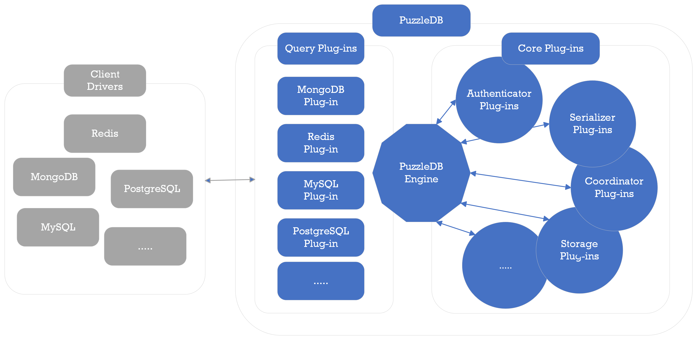

    

PuzzleDB aspires to be a high-performance, distributed, cloud-native, multi-API, multi-model database. This Technology Preview version has been developed in the Go language.

# What is PuzzleDB

PuzzleDB is a multi-data model database capable of handling key-value, relational, and document models. Additionally, PuzzleDB is a multi-interface database, compatible with existing database protocols such as PostgreSQL, MySQL, Redis, and MongoDB.

PuzzleDB is a distributed database framework supporting various data models and protocols. It is designed as a flexible, scalable, and efficient database framework suitable for various environments.

PuzzleDB accommodates existing query protocols such as PostgreSQL, MySQL, MongoDB, and Redis within a distributed, pluggable database framework. Consequently, developers can seamlessly start using PuzzleDB as a scalable, high-performance distributed database with existing database client drivers, eliminating any learning curve.

## Features

PuzzleDB has the following features:

-   Flexibility: PuzzleDB allows extensibility through its plugin architecture and pluggable modules for queries, data models, storage, and more.

-   Scalability: PuzzleDB seamlessly transitions from an in-memory standalone storage plugin module to a scalable, shared-nothing, horizontally distributed database using an ordered distributed key-value store plugin module.

-   Facility: PuzzleDB supports major database model and protocol plugin modules, such as Redis, MongoDB, and MySQL, simplifying application migration.

-   Safety: PuzzleDB offers ACID-compliant plugin modules, enabling the development of intuitive and secure applications.

-   Efficiency: PuzzleDB manages various database data models, including key-value, document, and relational, by consolidating them into a single core model.

# Get Started

See the following guide to learn about how to get started.

-   [Quick Start](doc/quick-start.md)

# How does PuzzleDB work?

The name PuzzleDB is derived from the ability to combine multiple modules such as coordinators, storages, and existing database protocol handlers to form a database. For information on the concept and architecture of PuzzleDB, refer to the following concept documents:

-   [Design Concepts](doc/concept.md)

    -   [Plug-In Concept](doc/plugin-concept.md)

    -   [Layer Concept](doc/layer-concept.md)

    -   [Data Model](doc/data-model.md)

    -   [Storage Concept](doc/storage-concept.md)

    -   [Consistency Model](doc/consistency-model.md)

    -   [Coordinator Concept](doc/coordinator-concept.md)

# Supported Protocols

PuzzleDB aspires to be a high-performance, distributed, cloud-native, multi-API, multi-model database. This Technology Preview version has been developed using the Go language.

-   Compatibility

    -   [PostgreSQL](doc/postgresql.md)

    -   [MySQL](doc/mysql.md)

    -   [MongoDB](doc/mongodb.md)

    -   [Redis](doc/redis.md)

# Roadmap

PuzzleDB is currently in a technical preview release stage. At present, it is in the process of developing and testing a distributed plugin for the upcoming release. The development roadmap for PuzzleDB is outlined below.

# User Guides

-   Get Started

    -   [Quick Start](doc/quick-start.md)

        -   [puzzledb-server](doc/cmd/server/puzzledb-server.md)

    -   [Configuring PullzeDB](doc/configuring.md)

-   Operation

    -   [CLI (puzzledb-cli)](doc/cmd/cli/puzzledb-cli.md)

    -   [Distributed Tracing](doc/tracing.md)

-   Benchmarking

    -   [puzzledb-bench](https://github.com/cybergarage/puzzledb-go/puzzledb-bench)

-   Distribution

    -   [Docker Hub (cybergarage/puzzledb)](https://hub.docker.com/repository/docker/cybergarage/puzzledb/general)

# Developer Guides

-   References

    -   [Go Reference](https://pkg.go.dev/github.com/cybergarage/puzzledb-go)

-   Contributing (Planning)

    -   [Coding Guidelines](doc/coding_guideline.md)

-   Building and Testing

    -   [Build on macOS](doc/build-on-macos.md)

    -   [Build on Ubuntu](doc/build-on-macos.md)

-   Extending PuzzleDB

    -   [Plug-In Concept](doc/plugin-concept.md)

    -   [Plug-in Services](doc/plugin-types.md)

        -   [Building User Plug-ins](doc/plugin-tutorial.md)

-   Specification

    -   [Coordinator Specification](doc/spec/coordinator-spec.md)

        -   [Coordinator Messaging Specification](doc/spec/coordinator-msg-spec.md)

        -   [Coordinator Key-Value Store Specification](doc/spec/coordinator-spec.md)

    -   Store Specification

        -   [Store Key-Value Specification](doc/spec/store-kv-spec.md)

    -   Transversed Specifications

        -   [Key-Value Store Specification](doc/spec/kv-store-spec.md)
