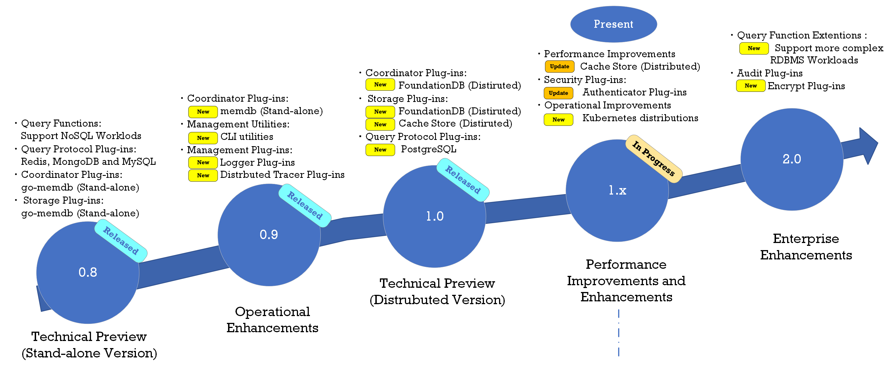

image:doc/img/logo.png[doc/img/logo]

image:https://img.shields.io/github/v/tag/cybergarage/puzzledb-go[GitHub tag (latest SemVer)]
https://github.com/cybergarage/puzzledb-go/actions/workflows/make.yml[image:https://github.com/cybergarage/puzzledb-go/actions/workflows/make.yml/badge.svg[Go]]
https://pkg.go.dev/github.com/cybergarage/puzzledb-go[image:https://pkg.go.dev/badge/github.com/cybergarage/puzzledb-go.svg[Go Reference]]
https://goreportcard.com/report/github.com/cybergarage/puzzledb-go[image:https://img.shields.io/badge/go%20report-A%2B-brightgreen[Go Report Card]]
https://codecov.io/gh/cybergarage/puzzledb-go[image:https://codecov.io/gh/cybergarage/puzzledb-go/branch/main/graph/badge.svg?token=C3Q82XPE44[codecov]]

PuzzleDB aspires to be a high-performance, distributed, cloud-native, multi-API, multi-model database. This Technology Preview version has been developed in the Go language.

include::doc/whatis.adoc[]

= Get Started

See the following guide to learn about how to get started.

* link:doc/quick-start.md[Quick Start]

= How does PuzzleDB work?

For information on the concept and architecture of PuzzleDB, refer to the following concept documents:

* link:doc/concept.md[Design Concepts]
** link:doc/plugin-concept.md[Plug-In Concept]
** link:doc/layer-concept.md[Layer Concept]
** link:doc/data-model.md[Data Model]
** link:doc/storage-concept.md[Storage Concept]
** link:doc/consistency-model.md[Consistency Model]
** link:doc/coordinator-concept.md[Coordinator Concept]

= Supported Protocols

PuzzleDB supports the following protocols:

* Compatibility
** link:doc/postgresql.md[PostgreSQL]
** link:doc/mysql.md[MySQL]
** link:doc/mongodb.md[MongoDB]
** link:doc/redis.md[Redis]

= Roadmap

PuzzleDB is currently in a technical preview release stage. At present, it is in the process of developing and testing a distributed plugin for the upcoming release. The development roadmap for PuzzleDB is outlined below.

= User Guides

* Get Started
** link:doc/quick-start.md[Quick Start]
*** link:doc/cmd/server/puzzledb-server.md[puzzledb-server]
** link:doc/configuring.md[Configuring PullzeDB]
* Operation
** link:doc/cmd/cli/puzzledb-cli.md[CLI (puzzledb-cli)]
** link:doc/tracing.md[Distributed Tracing]
* Benchmarking
** link:https://github.com/cybergarage/puzzledb-go/puzzledb-bench[puzzledb-bench]
* Distribution
** link:https://hub.docker.com/repository/docker/cybergarage/puzzledb/general[Docker Hub (cybergarage/puzzledb)]

= Developer Guides

* References
** link:https://pkg.go.dev/github.com/cybergarage/puzzledb-go[Go Reference]
* Contributing (Planning)
** link:doc/coding_guideline.md[Coding Guidelines]
* Building and Testing
** link:doc/build-on-macos.md[Build on macOS]
** link:doc/build-on-macos.md[Build on Ubuntu]
* Extending PuzzleDB
** link:doc/plugin-concept.md[Plug-In Concept]
** link:doc/plugin-types.md[Plug-in Services]
*** link:doc/plugin-tutorial.md[Building User Plug-ins]
* Specification
** link:doc/spec/coordinator-spec.md[Coordinator Specification]
*** link:doc/spec/coordinator-msg-spec.md[Coordinator Messaging Specification]
*** link:doc/spec/coordinator-spec.md[Coordinator Key-Value Store Specification]
** Store Specification
*** link:doc/spec/store-kv-spec.md[Store Key-Value Specification]
** Transversed Specifications
*** link:doc/spec/kv-store-spec.md[Key-Value Store Specification]
