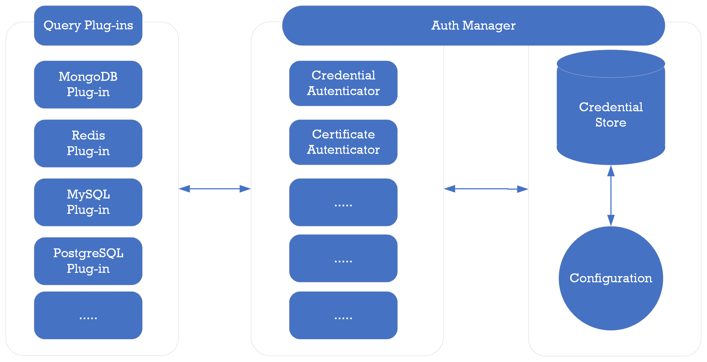

= Authentication Methods

PuzzleDB adds authenticators to the auth manager based on the auth configuration with auth plugins. The query plugins can query the authentication from the auth manager.

An authenticator is generated from one auth plugin and a configuration. Multiple authenticators are generated and added to the auth manager when PuzzleDB starts.

== Authentication Plugins

PuzzleDB offers the following common authentication plugins for query plugins as default.

* Password
* MD5 (Not yes supported)
* Crypt (Not yes supported)
* SHA256 (Not yes supported)
* SHA512 (Not yes supported)
* GSSAPI (Not yes supported)
* SSPI (Not yes supported)
* LDAP (Not yes supported)
* PAM (Not yes supported)
* Kerberos (Not yes supported)

== Supported Authentication Methods

PuzzleDB supports the following authentication methods for the query plugins.

[format="csv", options="header, autowidth"]
|====
include::auth/methods.csv[]
|====

O:Supported, X:Unsupported, -:Not yes supported

== References

=== PostgreSQL

* https://www.postgresql.org/docs/current/auth-methods.html[PostgreSQL: Documentation: Authentication Methods]
** https://www.postgresql.org/docs/current/auth-pg-hba-conf.html[PostgreSQL: Documentation: The pg_hba.conf File]

== MySQL
* https://dev.mysql.com/doc/dev/mysql-server/latest/page_protocol_connection_phase.html[MySQL: Connection Phase]
* https://dev.mysql.com/doc/dev/mysql-server/latest/page_protocol_connection_phase_authentication_methods.html[MySQL: Authentication Methods]
** https://dev.mysql.com/doc/dev/mysql-server/latest/page_protocol_connection_phase_authentication_methods.html#page_protocol_connection_phase_authentication_methods_old_password_authentication[MySQL: Old Password Authentication]
** https://dev.mysql.com/doc/dev/mysql-server/latest/page_protocol_connection_phase_authentication_methods_native_password_authentication.html[MySQL: Native Password Authentication]

== MongoDB

* https://www.mongodb.com/docs/manual/security/[Security — MongoDB Manual]
** https://www.mongodb.com/docs/manual/core/authentication/[Authentication — MongoDB Manual]
** https://www.mongodb.com/docs/atlas/security/config-db-auth/[Configure Database User Authentication — MongoDB Atlas]

== Redis

* https://redis.io/docs/management/security/[Security – Redis]
** https://redis.io/commands/auth/[AUTH | Redis]