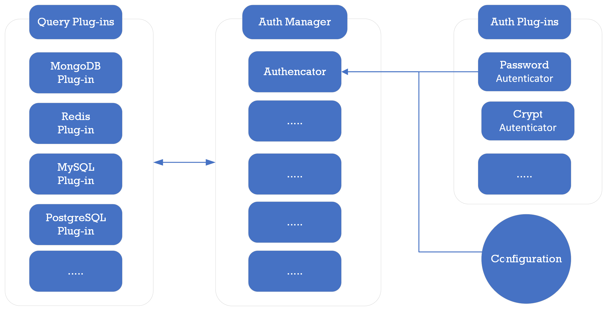

# Authentication Methods

PuzzleDB includes a authenticator manager to manage the authentication for the query plugins.

<figure>

</figure>

The authenticator manager supports multiple authentication methods, including username and password authentication, SASL (Simple Authentication and Security Layer) authentication, and certificate-based authentication.

## Authentication Plugins

PuzzleDB supports the following authentication methods for the query plugins.

-   Plain

-   SCRAM-SHA-256

-   Certificate (TLS Client Certificate)

-   MD5 (Not yes supported)

-   Crypt (Not yes supported)

-   LDAP (Not yes supported)

-   PAM (Not yes supported)

-   Kerberos (Not yes supported)

## Supported Authentication Methods

PuzzleDB supports the following authentication methods for the query plugins.

<table style="width:100%;">
<colgroup>
<col style="width: 16%" />
<col style="width: 16%" />
<col style="width: 16%" />
<col style="width: 16%" />
<col style="width: 16%" />
<col style="width: 16%" />
</colgroup>
<thead>
<tr>
<th style="text-align: left;">Method</th>
<th style="text-align: left;">Parameter</th>
<th style="text-align: left;">PostgreSQL</th>
<th style="text-align: left;">MySQL</th>
<th style="text-align: left;">MongoDB</th>
<th style="text-align: left;">Redis</th>
</tr>
</thead>
<tbody>
<tr>
<td style="text-align: left;">
Plain
</td>
<td style="text-align: left;">
user
</td>
<td style="text-align: left;">
O
</td>
<td style="text-align: left;">
-
</td>
<td style="text-align: left;">
-
</td>
<td style="text-align: left;">
O
</td>
</tr>
<tr>
<td style="text-align: left;"></td>
<td style="text-align: left;">
password
</td>
<td style="text-align: left;">
O
</td>
<td style="text-align: left;">
-
</td>
<td style="text-align: left;">
-
</td>
<td style="text-align: left;">
O
</td>
</tr>
<tr>
<td style="text-align: left;">
SCRAM-SHA-256
</td>
<td style="text-align: left;">
user
</td>
<td style="text-align: left;">
-
</td>
<td style="text-align: left;">
-
</td>
<td style="text-align: left;">
O
</td>
<td style="text-align: left;">
-
</td>
</tr>
<tr>
<td style="text-align: left;"></td>
<td style="text-align: left;">
password
</td>
<td style="text-align: left;">
-
</td>
<td style="text-align: left;">
-
</td>
<td style="text-align: left;">
O
</td>
<td style="text-align: left;">
-
</td>
</tr>
<tr>
<td style="text-align: left;">
Certificate (TLS)
</td>
<td style="text-align: left;">
common name
</td>
<td style="text-align: left;">
O
</td>
<td style="text-align: left;">
O
</td>
<td style="text-align: left;">
O
</td>
<td style="text-align: left;">
O
</td>
</tr>
</tbody>
</table>

O:Supported, X:Unsupported, -:Not yes supported

## References

### PostgreSQL

-   [PostgreSQL: Documentation: Authentication Methods](https://www.postgresql.org/docs/current/auth-methods.html)

    -   [PostgreSQL: Documentation: The pg\_hba.conf File](https://www.postgresql.org/docs/current/auth-pg-hba-conf.html)

## MySQL

-   [MySQL: Connection Phase](https://dev.mysql.com/doc/dev/mysql-server/latest/page_protocol_connection_phase.html)

-   [MySQL: Authentication Methods](https://dev.mysql.com/doc/dev/mysql-server/latest/page_protocol_connection_phase_authentication_methods.html)

    -   [MySQL: Old Password Authentication](https://dev.mysql.com/doc/dev/mysql-server/latest/page_protocol_connection_phase_authentication_methods.html#page_protocol_connection_phase_authentication_methods_old_password_authentication)

    -   [MySQL: Native Password Authentication](https://dev.mysql.com/doc/dev/mysql-server/latest/page_protocol_connection_phase_authentication_methods_native_password_authentication.html)

## MongoDB

-   [Security — MongoDB Manual](https://www.mongodb.com/docs/manual/security/)

    -   [Authentication — MongoDB Manual](https://www.mongodb.com/docs/manual/core/authentication/)

    -   [Configure Database User Authentication — MongoDB Atlas](https://www.mongodb.com/docs/atlas/security/config-db-auth/)

## Redis

-   [Security – Redis](https://redis.io/docs/management/security/)

    -   [AUTH | Redis](https://redis.io/commands/auth/)
