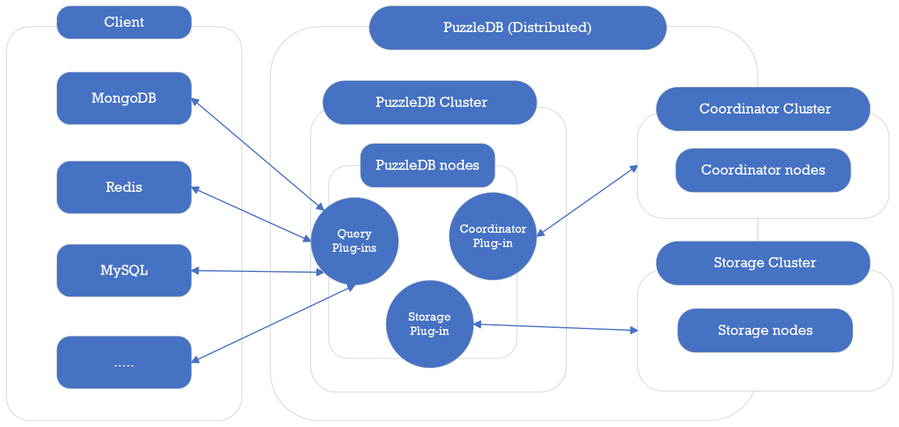
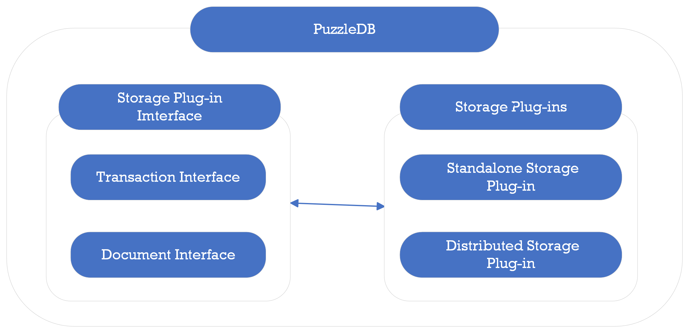

# Design Concepts

This section describes the architecture and design concepts of PuzzleDB.

# Layer Concept

PuzzleDB adopts a unique approach similar to FoundationDB and early Google Spanner. It offers high scalability and ACID transactions while constructing its data model, indexes, and query processing on a foundation of simple key-value storage without any query functionality. In PuzzleDB, not only are records represented as key-value pairs, but schemas and indices are also represented as key-value data.

## References

-   [FoundationDB](https://www.foundationdb.org/)

-   [Layer Concept — FoundationDB](https://apple.github.io/foundationdb/layer-concept.html)

-   [Spanner: Google’s Globally-Distributed Database](https://research.google/pubs/pub39966/)

-   [Announcing FoundationDB Document Layer](https://www.foundationdb.org/blog/announcing-document-layer/)

-   [FoundationDB Record Layer](https://foundationdb.github.io/fdb-record-layer/)

# Plug-In Concepts

PuzzleDB is a pluggable database that combines components, and a pluggable component interface is defined based on a FoundationDB-like layering concept. PuzzleDB separates the query layer and data model from the storage layer, the lowest storage layer is defined as a simple Key-Value store like FoundationDB and early Google Spanner.

PuzzleDB defines the coordinator and storage function interfaces to run as standalone and distributed databases. PuzzleDB runs as a distributed multi-API and multi-model database with the distributed coordinator and storage plug-ins.

# Plug-In Services

PuzzleDB provides default plug-in services that include query, storage, and coordinator plug-ins and defines the default plug-in types as follows:

<table style="width:100%;">
<colgroup>
<col style="width: 16%" />
<col style="width: 16%" />
<col style="width: 16%" />
<col style="width: 16%" />
<col style="width: 16%" />
<col style="width: 16%" />
</colgroup>
<thead>
<tr class="header">
<th style="text-align: left;">Major Type</th>
<th style="text-align: left;">Sub Type</th>
<th style="text-align: left;">Description</th>
<th style="text-align: left;">Plug-ins</th>
<th style="text-align: left;">Distributed</th>
<th style="text-align: left;">Dependency</th>
</tr>
</thead>
<tbody>
<tr class="odd">
<td style="text-align: left;">
Query
</td>
<td style="text-align: left;">
-
</td>
<td style="text-align: left;">
Query handler services
</td>
<td style="text-align: left;">
Redis
</td>
<td style="text-align: left;">
O
</td>
<td style="text-align: left;">
Store (Document)
</td>
</tr>
<tr class="even">
<td style="text-align: left;"></td>
<td style="text-align: left;"></td>
<td style="text-align: left;"></td>
<td style="text-align: left;">
MongoDB
</td>
<td style="text-align: left;">
O
</td>
<td style="text-align: left;">
Store (Document)
</td>
</tr>
<tr class="odd">
<td style="text-align: left;"></td>
<td style="text-align: left;"></td>
<td style="text-align: left;"></td>
<td style="text-align: left;">
MySQL
</td>
<td style="text-align: left;">
O
</td>
<td style="text-align: left;">
Store (Document)
</td>
</tr>
<tr class="even">
<td style="text-align: left;"></td>
<td style="text-align: left;"></td>
<td style="text-align: left;"></td>
<td style="text-align: left;">
PostgreSQL (Planning)
</td>
<td style="text-align: left;">
O
</td>
<td style="text-align: left;">
Store (Document)
</td>
</tr>
<tr class="odd">
<td style="text-align: left;">
Coordinator
</td>
<td style="text-align: left;">
-
</td>
<td style="text-align: left;">
Coordination services
</td>
<td style="text-align: left;">
memdb
</td>
<td style="text-align: left;">
X
</td>
<td style="text-align: left;">
-
</td>
</tr>
<tr class="even">
<td style="text-align: left;"></td>
<td style="text-align: left;"></td>
<td style="text-align: left;"></td>
<td style="text-align: left;">
etcd (Planning)
</td>
<td style="text-align: left;">
O
</td>
<td style="text-align: left;">
-
</td>
</tr>
<tr class="odd">
<td style="text-align: left;"></td>
<td style="text-align: left;"></td>
<td style="text-align: left;"></td>
<td style="text-align: left;">
ZooKeeper (Planning)
</td>
<td style="text-align: left;"></td>
<td style="text-align: left;"></td>
</tr>
<tr class="even">
<td style="text-align: left;"></td>
<td style="text-align: left;"></td>
<td style="text-align: left;"></td>
<td style="text-align: left;">
FoundationDB (Planning)
</td>
<td style="text-align: left;">
O
</td>
<td style="text-align: left;">
-
</td>
</tr>
<tr class="odd">
<td style="text-align: left;">
Coder
</td>
<td style="text-align: left;">
Document
</td>
<td style="text-align: left;">
Document coder services
</td>
<td style="text-align: left;">
CBOR
</td>
<td style="text-align: left;">
O
</td>
<td style="text-align: left;">
-
</td>
</tr>
<tr class="even">
<td style="text-align: left;"></td>
<td style="text-align: left;">
Key
</td>
<td style="text-align: left;">
Key coder services
</td>
<td style="text-align: left;">
Tuple
</td>
<td style="text-align: left;">
O
</td>
<td style="text-align: left;">
-
</td>
</tr>
<tr class="odd">
<td style="text-align: left;">
Store
</td>
<td style="text-align: left;">
Document
</td>
<td style="text-align: left;">
Doument store services
</td>
<td style="text-align: left;">
Key-value based store
</td>
<td style="text-align: left;">
O
</td>
<td style="text-align: left;">
Store (Key-value), Coder (Document), Coder (Key)
</td>
</tr>
<tr class="even">
<td style="text-align: left;"></td>
<td style="text-align: left;">
Key-value
</td>
<td style="text-align: left;">
Key-value store services
</td>
<td style="text-align: left;">
memdb
</td>
<td style="text-align: left;">
X
</td>
<td style="text-align: left;">
Coder (Document), Coder (Key)
</td>
</tr>
<tr class="odd">
<td style="text-align: left;"></td>
<td style="text-align: left;"></td>
<td style="text-align: left;"></td>
<td style="text-align: left;">
FoundationDB
</td>
<td style="text-align: left;">
O
</td>
<td style="text-align: left;">
Coder (Document), Coder (Key)
</td>
</tr>
<tr class="even">
<td style="text-align: left;"></td>
<td style="text-align: left;"></td>
<td style="text-align: left;"></td>
<td style="text-align: left;">
Key-value Cahche (Planning)
</td>
<td style="text-align: left;">
O
</td>
<td style="text-align: left;">
Store (Key-value), Coordinator
</td>
</tr>
<tr class="odd">
<td style="text-align: left;"></td>
<td style="text-align: left;"></td>
<td style="text-align: left;"></td>
<td style="text-align: left;">
TiKV (Planning)
</td>
<td style="text-align: left;">
O
</td>
<td style="text-align: left;">
-
</td>
</tr>
<tr class="even">
<td style="text-align: left;">
Extend
</td>
<td style="text-align: left;">
-
</td>
<td style="text-align: left;">
User-defined services
</td>
<td style="text-align: left;">
-
</td>
<td style="text-align: left;">
-
</td>
<td style="text-align: left;">
-
</td>
</tr>
</tbody>
</table>

-   Distributed: Indicates whether the plug-in service supports distributed operation. The non-distributed plug-ins are provided for standalone operation or for internal testing of PuzzleDB.

-   Dependency: Indicates other plug-in service types required to run the plug-in service.

## Plug-In Interfaces

PuzzleDB defines the core plug-in interfaces based on the following concepts.

### Query Interface

PuzzleDB defines the query interface to support any database protocol such as Redis, MongoDB, and MySQL protocols. The query interface is kept to a minimal specification to support a wide variety of database protocols.

### Storage Interface

PuzzleDB defines the low-level storage interface as an ordered key-value store like early Google Spanner. PuzzleDB expects that the storage plug-in components are implemented based on ordered key-value stores like FoundationDB rather than non-ordered hashing key-value stores like MongoDB and Cassandra.

### Coordinator Interface

PuzzleDB defines the coordinator interface to synchronize between PuzzleDB nodes. PuzzleDB expects that the coordinator components are implemented based on existing distributed coordinator services such as Apache ZooKeeper or etcd.

## References

-   [FoundationDB](https://www.foundationdb.org/)

    -   [Layer Concept - FoundationDB](https://apple.github.io/foundationdb/layer-concept.html)

-   [Google Cloud Spanner](https://cloud.google.com/spanner/)

    -   [Whitepapers | Cloud Spanner | Google Cloud](https://cloud.google.com/spanner/docs/whitepapers)

    -   [What is Cloud Spanner? A gcpsketchnote cheat sheet | Google Cloud Blog](https://cloud.google.com/blog/en/topics/developers-practitioners/what-cloud-spanner?hl=en)

    -   [Spanner: Google’s Globally-Distributed Database](https://research.google/pubs/pub39966/)

# Consistency Model

PuzzleDB is a multi-data model database; PuzzleDB is a pluggable database that combines modules, and the storage layer modules are expected to satisfy ACID-like interfaces.

PuzzleDB defines the top-level storage plug-in as a document model interface, and the storage interface consists of transaction and document interfaces.

<figure>

</figure>

While developers can omit the interface and implement the storage plug-ins based on non-ACID storage, such as contingent consistency model storage, PuzzleDB expects that storage modules are implemented based on ACID storages.

# Data Model

PuzzleDB is a multi-data model database and the core data model is a document model, and the document model is constructed based on a key value model currently. PuzzleDB represents all database objects such as data objects, schema objects, and index objects as document data. Document data are ultimately stored as Key-Value objects.

<figure>

</figure>

PuzzleDB defines a plug-in interface to the Key-Value store, which allows importing small local in-memory databases like memdb or large distributed databases like FoundationDB or TiKV.

## Document Model

PuzzleDB is a multi-data model database and the core data model is a document model like CosmosDB. PuzzleDB is a pluggable database that combines modules, and the storage layer modules must be as expressive as JSON or BSON like ARS (Atom-Record-Sequence) of CosmosDB.

PuzzleDB is a multi-model database, which converts any data models such as relational and document database models into the PuzzleDB data model as follows:

<table>
<colgroup>
<col style="width: 20%" />
<col style="width: 20%" />
<col style="width: 20%" />
<col style="width: 20%" />
<col style="width: 20%" />
</colgroup>
<thead>
<tr class="header">
<th style="text-align: left;">Type</th>
<th style="text-align: left;">PuzzleDB</th>
<th style="text-align: left;">Redis</th>
<th style="text-align: left;">MongoDB</th>
<th style="text-align: left;">SQL</th>
</tr>
</thead>
<tbody>
<tr class="odd">
<td style="text-align: left;">
Collection
</td>
<td style="text-align: left;">
map
</td>
<td style="text-align: left;">
Hash
</td>
<td style="text-align: left;">
Object
</td>
<td style="text-align: left;">
COMPLEX
</td>
</tr>
<tr class="even">
<td style="text-align: left;"></td>
<td style="text-align: left;">
array
</td>
<td style="text-align: left;">
List
</td>
<td style="text-align: left;">
Array
</td>
<td style="text-align: left;">
ARRAY
</td>
</tr>
<tr class="odd">
<td style="text-align: left;"></td>
<td style="text-align: left;"></td>
<td style="text-align: left;">
Sets
</td>
<td style="text-align: left;"></td>
<td style="text-align: left;"></td>
</tr>
<tr class="even">
<td style="text-align: left;"></td>
<td style="text-align: left;"></td>
<td style="text-align: left;">
Sorted Sets
</td>
<td style="text-align: left;"></td>
<td style="text-align: left;"></td>
</tr>
<tr class="odd">
<td style="text-align: left;">
String
</td>
<td style="text-align: left;">
string
</td>
<td style="text-align: left;"></td>
<td style="text-align: left;">
String
</td>
<td style="text-align: left;">
VARCHAR
</td>
</tr>
<tr class="even">
<td style="text-align: left;"></td>
<td style="text-align: left;"></td>
<td style="text-align: left;"></td>
<td style="text-align: left;"></td>
<td style="text-align: left;">
CHAR
</td>
</tr>
<tr class="odd">
<td style="text-align: left;">
Integer
</td>
<td style="text-align: left;">
tiny
</td>
<td style="text-align: left;"></td>
<td style="text-align: left;"></td>
<td style="text-align: left;">
TINYINT
</td>
</tr>
<tr class="even">
<td style="text-align: left;"></td>
<td style="text-align: left;">
short
</td>
<td style="text-align: left;"></td>
<td style="text-align: left;"></td>
<td style="text-align: left;">
SMALLINT
</td>
</tr>
<tr class="odd">
<td style="text-align: left;"></td>
<td style="text-align: left;">
int
</td>
<td style="text-align: left;"></td>
<td style="text-align: left;">
32-bit integer
</td>
<td style="text-align: left;">
INTEGER
</td>
</tr>
<tr class="even">
<td style="text-align: left;"></td>
<td style="text-align: left;">
long
</td>
<td style="text-align: left;"></td>
<td style="text-align: left;">
64-bit integer
</td>
<td style="text-align: left;">
BIGINT
</td>
</tr>
<tr class="odd">
<td style="text-align: left;">
Real
</td>
<td style="text-align: left;">
float32
</td>
<td style="text-align: left;"></td>
<td style="text-align: left;">
32-bit IEEE-754
</td>
<td style="text-align: left;">
FLOAT
</td>
</tr>
<tr class="even">
<td style="text-align: left;"></td>
<td style="text-align: left;">
float64
</td>
<td style="text-align: left;"></td>
<td style="text-align: left;">
64-bit IEEE-754
</td>
<td style="text-align: left;">
DOUBLE (REAL)
</td>
</tr>
<tr class="odd">
<td style="text-align: left;">
Time
</td>
<td style="text-align: left;">
time.Time
</td>
<td style="text-align: left;"></td>
<td style="text-align: left;">
Date
</td>
<td style="text-align: left;">
DATE DATETIME
</td>
</tr>
<tr class="even">
<td style="text-align: left;"></td>
<td style="text-align: left;"></td>
<td style="text-align: left;"></td>
<td style="text-align: left;">
Timestamp
</td>
<td style="text-align: left;">
TIME TIMESTAMP
</td>
</tr>
<tr class="odd">
<td style="text-align: left;">
Special
</td>
<td style="text-align: left;">
null
</td>
<td style="text-align: left;"></td>
<td style="text-align: left;">
Null
</td>
<td style="text-align: left;">
NULL
</td>
</tr>
<tr class="even">
<td style="text-align: left;"></td>
<td style="text-align: left;">
bool
</td>
<td style="text-align: left;"></td>
<td style="text-align: left;">
Boolean
</td>
<td style="text-align: left;">
BOOLEAN (TINYINT(1))
</td>
</tr>
<tr class="odd">
<td style="text-align: left;"></td>
<td style="text-align: left;">
[]byte
</td>
<td style="text-align: left;">
String
</td>
<td style="text-align: left;">
Binary data
</td>
<td style="text-align: left;">
BLOB (BYTEA)
</td>
</tr>
</tbody>
</table>

## Key-Value Model

The document model is not natively implemented and is currently built on a key-value model with a coder plugin module. PuzzleDB provides a default coder, the CBOR (Concise Binary Object Representation ) plug-in module as the default coder.

PuzzleDB encodes a document data with a coder and stores it as a key-value data. The relationship between the default coder, CBOR data model, and the document data model is shown below.

<table>
<colgroup>
<col style="width: 33%" />
<col style="width: 33%" />
<col style="width: 33%" />
</colgroup>
<thead>
<tr class="header">
<th style="text-align: left;">Type</th>
<th style="text-align: left;">PuzzleDB</th>
<th style="text-align: left;">CBOR</th>
</tr>
</thead>
<tbody>
<tr class="odd">
<td style="text-align: left;">
Collection
</td>
<td style="text-align: left;">
map
</td>
<td style="text-align: left;">
5 (map)
</td>
</tr>
<tr class="even">
<td style="text-align: left;"></td>
<td style="text-align: left;">
array
</td>
<td style="text-align: left;">
4 (array)
</td>
</tr>
<tr class="odd">
<td style="text-align: left;">
String
</td>
<td style="text-align: left;">
string
</td>
<td style="text-align: left;">
3 (text string)
</td>
</tr>
<tr class="even">
<td style="text-align: left;">
Integer
</td>
<td style="text-align: left;">
tiny
</td>
<td style="text-align: left;">
tiny
</td>
</tr>
<tr class="odd">
<td style="text-align: left;"></td>
<td style="text-align: left;">
short
</td>
<td style="text-align: left;">
short
</td>
</tr>
<tr class="even">
<td style="text-align: left;"></td>
<td style="text-align: left;">
int
</td>
<td style="text-align: left;">
int
</td>
</tr>
<tr class="odd">
<td style="text-align: left;"></td>
<td style="text-align: left;">
long
</td>
<td style="text-align: left;">
long
</td>
</tr>
<tr class="even">
<td style="text-align: left;">
Real
</td>
<td style="text-align: left;">
float32
</td>
<td style="text-align: left;">
7 (floating-point) 26
</td>
</tr>
<tr class="odd">
<td style="text-align: left;"></td>
<td style="text-align: left;">
float64
</td>
<td style="text-align: left;">
7 (floating-point) 27
</td>
</tr>
<tr class="even">
<td style="text-align: left;">
Time
</td>
<td style="text-align: left;">
time.Time
</td>
<td style="text-align: left;">
6 (tag) 0
</td>
</tr>
<tr class="odd">
<td style="text-align: left;">
Special
</td>
<td style="text-align: left;">
null
</td>
<td style="text-align: left;">
null
</td>
</tr>
<tr class="even">
<td style="text-align: left;"></td>
<td style="text-align: left;">
bool
</td>
<td style="text-align: left;">
bool
</td>
</tr>
<tr class="odd">
<td style="text-align: left;"></td>
<td style="text-align: left;">
[]byte
</td>
<td style="text-align: left;">
binary
</td>
</tr>
</tbody>
</table>

## References

-   [A technical overview of Azure Cosmos DB | Azure Blog and Updates | Microsoft Azure](https://azure.microsoft.com/en-gb/blog/a-technical-overview-of-azure-cosmos-db/)

-   [Azure Cosmos DB conceptual whitepapers](https://learn.microsoft.com/en-us/azure/cosmos-db/whitepapers)

-   [Schema-Agnostic Indexing with Azure DocumentDB](https://www.vldb.org/pvldb/vol8/p1668-shukla.pdf)

-   [CBOR — Concise Binary Object Representation | Overview](http://cbor.io/)
