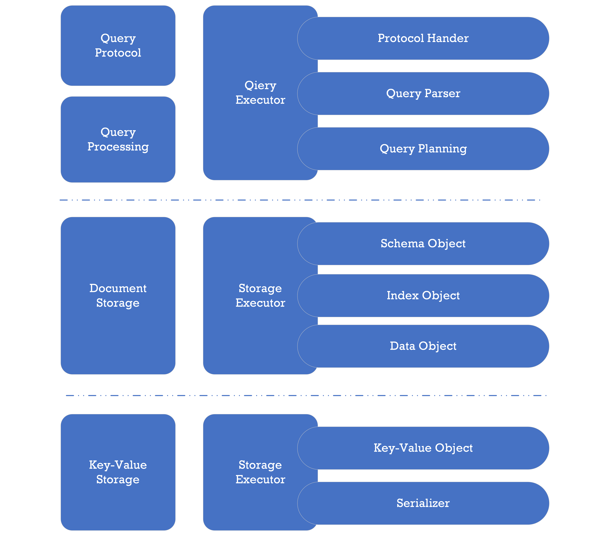

# Design Concepts

PuzzleDB applies a NewSQL-style architecture built on an ordered key-value foundation for its data model, indexes, and queries—enabling high scalability with ACID transactions. This section outlines the core architecture and design concepts.

# Layer Concept

PuzzleDB adopts an approach similar to FoundationDB and early Google Spanner: high scalability and ACID transactions built atop a simple ordered key‑value substrate without embedded query functionality.

PuzzleDB loosely couples the query APIs, data model, and storage engine, enabling tailored compositions for specific workloads. Records, schemas, and indexes are all materialized as key‑value data.

# References

- [FoundationDB](https://www.foundationdb.org/)

  - [Layer Concept — FoundationDB](https://apple.github.io/foundationdb/layer-concept.html)

  - [Announcing FoundationDB Document Layer](https://www.foundationdb.org/blog/announcing-document-layer/)

<!-- -->

- [Google Cloud Spanner](https://cloud.google.com/spanner/)

  - [Whitepapers | Cloud Spanner | Google Cloud](https://cloud.google.com/spanner/docs/whitepapers)

  - [What is Cloud Spanner? A gcpsketchnote cheat sheet | Google Cloud Blog](https://cloud.google.com/blog/en/topics/developers-practitioners/what-cloud-spanner?hl=en)

  - [F1: a distributed SQL database that scales: Proceedings of the VLDB Endowment: Vol 6, No 11](https://dl.acm.org/doi/10.14778/2536222.2536232)

  - [Spanner: Google’s Globally-Distributed Database](https://research.google/pubs/pub39966/)

  - [Spanner: Becoming a SQL System](https://dl.acm.org/doi/10.1145/3035918.3056103)

# Data Model

PuzzleDB is a multi‑model database. The core logical model is a document model layered atop an ordered key‑value store. All objects (data, schema, indexes) are represented as documents and ultimately persisted as key‑value pairs.

<figure>

</figure>

PuzzleDB defines a storage plugin interface enabling use of local in‑memory stores (e.g. memdb) or large distributed stores (e.g. FoundationDB, TiKV).

## Document Model

The document model must be expressive (JSON / BSON level) similar to ARS (Atom‑Record‑Sequence) in CosmosDB.

PuzzleDB maps external data models (relational, document, key‑value) into its internal document representation:

<table style="width:100%;">
<colgroup>
<col style="width: 16%" />
<col style="width: 16%" />
<col style="width: 16%" />
<col style="width: 16%" />
<col style="width: 16%" />
<col style="width: 16%" />
</colgroup>
<thead>
<tr>
<th style="text-align: left;">Type</th>
<th style="text-align: left;">PuzzleDB</th>
<th style="text-align: left;">Redis</th>
<th style="text-align: left;">MongoDB</th>
<th style="text-align: left;">MySQL</th>
<th style="text-align: left;">PostgreSQL</th>
</tr>
</thead>
<tbody>
<tr>
<td style="text-align: left;">
Collection
</td>
<td style="text-align: left;">
map
</td>
<td style="text-align: left;">
Hash
</td>
<td style="text-align: left;">
Object
</td>
<td style="text-align: left;">
COMPLEX
</td>
<td style="text-align: left;"></td>
</tr>
<tr>
<td style="text-align: left;"></td>
<td style="text-align: left;">
array
</td>
<td style="text-align: left;">
List
</td>
<td style="text-align: left;">
Array
</td>
<td style="text-align: left;">
ARRAY
</td>
<td style="text-align: left;"></td>
</tr>
<tr>
<td style="text-align: left;"></td>
<td style="text-align: left;"></td>
<td style="text-align: left;">
Sets
</td>
<td style="text-align: left;"></td>
<td style="text-align: left;"></td>
<td style="text-align: left;"></td>
</tr>
<tr>
<td style="text-align: left;"></td>
<td style="text-align: left;"></td>
<td style="text-align: left;">
Sorted Sets
</td>
<td style="text-align: left;"></td>
<td style="text-align: left;"></td>
<td style="text-align: left;"></td>
</tr>
<tr>
<td style="text-align: left;">
String
</td>
<td style="text-align: left;">
string
</td>
<td style="text-align: left;">
String
</td>
<td style="text-align: left;">
String
</td>
<td style="text-align: left;">
TEXT
</td>
<td style="text-align: left;">
TEXT
</td>
</tr>
<tr>
<td style="text-align: left;"></td>
<td style="text-align: left;"></td>
<td style="text-align: left;"></td>
<td style="text-align: left;"></td>
<td style="text-align: left;">
VARCHAR
</td>
<td style="text-align: left;">
VARCHAR
</td>
</tr>
<tr>
<td style="text-align: left;"></td>
<td style="text-align: left;"></td>
<td style="text-align: left;"></td>
<td style="text-align: left;"></td>
<td style="text-align: left;">
CHAR
</td>
<td style="text-align: left;">
CHAR
</td>
</tr>
<tr>
<td style="text-align: left;">
Integer
</td>
<td style="text-align: left;">
tiny
</td>
<td style="text-align: left;"></td>
<td style="text-align: left;"></td>
<td style="text-align: left;">
TINYINT
</td>
<td style="text-align: left;"></td>
</tr>
<tr>
<td style="text-align: left;"></td>
<td style="text-align: left;">
short
</td>
<td style="text-align: left;"></td>
<td style="text-align: left;"></td>
<td style="text-align: left;">
SMALLINT
</td>
<td style="text-align: left;">
SMALLINT
</td>
</tr>
<tr>
<td style="text-align: left;"></td>
<td style="text-align: left;">
int
</td>
<td style="text-align: left;"></td>
<td style="text-align: left;">
32-bit integer
</td>
<td style="text-align: left;">
INTEGER
</td>
<td style="text-align: left;">
INTEGER
</td>
</tr>
<tr>
<td style="text-align: left;"></td>
<td style="text-align: left;">
long
</td>
<td style="text-align: left;"></td>
<td style="text-align: left;">
64-bit integer
</td>
<td style="text-align: left;">
BIGINT
</td>
<td style="text-align: left;">
BIGINT
</td>
</tr>
<tr>
<td style="text-align: left;">
Real
</td>
<td style="text-align: left;">
float32
</td>
<td style="text-align: left;"></td>
<td style="text-align: left;">
32-bit IEEE-754
</td>
<td style="text-align: left;">
FLOAT
</td>
<td style="text-align: left;">
REAL
</td>
</tr>
<tr>
<td style="text-align: left;"></td>
<td style="text-align: left;">
float64
</td>
<td style="text-align: left;"></td>
<td style="text-align: left;">
64-bit IEEE-754
</td>
<td style="text-align: left;">
DOUBLE (REAL)
</td>
<td style="text-align: left;">
DOUBLE (REAL)
</td>
</tr>
<tr>
<td style="text-align: left;">
Time
</td>
<td style="text-align: left;">
time.Time
</td>
<td style="text-align: left;"></td>
<td style="text-align: left;">
Date
</td>
<td style="text-align: left;">
DATE DATETIME
</td>
<td style="text-align: left;"></td>
</tr>
<tr>
<td style="text-align: left;"></td>
<td style="text-align: left;"></td>
<td style="text-align: left;"></td>
<td style="text-align: left;">
Timestamp
</td>
<td style="text-align: left;">
TIME TIMESTAMP
</td>
<td style="text-align: left;">
TIMESTAMP
</td>
</tr>
<tr>
<td style="text-align: left;">
Special
</td>
<td style="text-align: left;">
null
</td>
<td style="text-align: left;"></td>
<td style="text-align: left;">
Null
</td>
<td style="text-align: left;">
NULL
</td>
<td style="text-align: left;">
NULL
</td>
</tr>
<tr>
<td style="text-align: left;"></td>
<td style="text-align: left;">
bool
</td>
<td style="text-align: left;"></td>
<td style="text-align: left;">
Boolean
</td>
<td style="text-align: left;">
BOOLEAN (TINYINT(1))
</td>
<td style="text-align: left;">
BOOLEAN
</td>
</tr>
<tr>
<td style="text-align: left;"></td>
<td style="text-align: left;">
[]byte
</td>
<td style="text-align: left;">
String
</td>
<td style="text-align: left;">
Binary data
</td>
<td style="text-align: left;">
BLOB (BYTEA)
</td>
<td style="text-align: left;">
BINARY
</td>
</tr>
</tbody>
</table>

### See also

- [plugins.query.sql.NewDocumentElementTypeFrom()](https://github.com/cybergarage/puzzledb-go/blob/main/puzzledb/plugins/query/sql/type.go)

- [plugins.query.mongo.BSONEncoder::EncodeBSON()](https://github.com/cybergarage/puzzledb-go/blob/main/puzzledb/plugins/query/mongo/encoder.go)

## Key-Value Object Model

The ordered key‑value model underpins all persisted objects. It provides flexible, scalable storage and efficient range operations.

All higher‑level objects are encoded as documents and stored as key‑value entries.

# Key Object

In PuzzleDB, records, schemas, and indices are all represented as key-value pairs. This section describes the format of the key object in detail.

## Key Header Specification

Every key object includes a header that specifies the key category, version, and the type of stored value. The key header is a 2-byte field prepended to every key in the key-value store. It is structured as follows:

<table>
<colgroup>
<col style="width: 25%" />
<col style="width: 25%" />
<col style="width: 25%" />
<col style="width: 25%" />
</colgroup>
<thead>
<tr>
<th style="text-align: left;">Field Name</th>
<th style="text-align: left;">Size (bits)</th>
<th style="text-align: left;">Description</th>
<th style="text-align: left;">Example Value</th>
</tr>
</thead>
<tbody>
<tr>
<td style="text-align: left;">
Key category
</td>
<td style="text-align: left;">
8
</td>
<td style="text-align: left;">
The record key type
</td>
<td style="text-align: left;">
D:Database C:Collection O:Document I:Index
</td>
</tr>
<tr>
<td style="text-align: left;">
Version
</td>
<td style="text-align: left;">
4
</td>
<td style="text-align: left;">
The version number
</td>
<td style="text-align: left;">
0:reserved 1:Current
</td>
</tr>
<tr>
<td style="text-align: left;">
Value type
</td>
<td style="text-align: left;">
4
</td>
<td style="text-align: left;">
The record value type
</td>
<td style="text-align: left;">
(Defined for each key category)
</td>
</tr>
</tbody>
</table>

Key headers start with a one-byte identifier that indicates the type of key, enabling efficient searches based on key type. Currently, the version is fixed at `1`. The value type is specified individually for each key category. The values are specified as follows:

<table>
<colgroup>
<col style="width: 50%" />
<col style="width: 50%" />
</colgroup>
<thead>
<tr>
<th style="text-align: left;">Category</th>
<th style="text-align: left;">Value Types</th>
</tr>
</thead>
<tbody>
<tr>
<td style="text-align: left;">
Database
</td>
<td style="text-align: left;">
0:reserved 1:CBOR
</td>
</tr>
<tr>
<td style="text-align: left;">
Collection
</td>
<td style="text-align: left;">
0:reserved 1:CBOR
</td>
</tr>
<tr>
<td style="text-align: left;">
Document
</td>
<td style="text-align: left;">
0:reserved 1:CBOR
</td>
</tr>
<tr>
<td style="text-align: left;">
Index
</td>
<td style="text-align: left;">
0:reserved 1:Primary 2:Secondary
</td>
</tr>
</tbody>
</table>

## Key Categories

The key-value store consists of key-value records, where each record is defined by a key-value pair and includes a header as part of the key. The store supports the following categories of key-value records:

<table style="width:100%;">
<colgroup>
<col style="width: 11%" />
<col style="width: 11%" />
<col style="width: 11%" />
<col style="width: 11%" />
<col style="width: 11%" />
<col style="width: 11%" />
<col style="width: 11%" />
<col style="width: 11%" />
<col style="width: 11%" />
</colgroup>
<thead>
<tr>
<th style="text-align: left;">Category</th>
<th style="text-align: left;">Key Order</th>
<th style="text-align: left;"></th>
<th style="text-align: left;"></th>
<th style="text-align: left;"></th>
<th style="text-align: left;"></th>
<th style="text-align: left;"></th>
<th style="text-align: left;"></th>
<th style="text-align: left;">Value</th>
</tr>
</thead>
<tbody>
<tr>
<td style="text-align: left;"></td>
<td style="text-align: left;">
0
</td>
<td style="text-align: left;">
1
</td>
<td style="text-align: left;">
2
</td>
<td style="text-align: left;">
3
</td>
<td style="text-align: left;">
4
</td>
<td style="text-align: left;">
5
</td>
<td style="text-align: left;">
6
</td>
<td style="text-align: left;"></td>
</tr>
<tr>
<td style="text-align: left;">
Database
</td>
<td style="text-align: left;">
Header (D)
</td>
<td style="text-align: left;">
Database Name
</td>
<td style="text-align: left;">
-
</td>
<td style="text-align: left;">
-
</td>
<td style="text-align: left;">
-
</td>
<td style="text-align: left;">
-
</td>
<td style="text-align: left;">
-
</td>
<td style="text-align: left;">
CBOR (Options)
</td>
</tr>
<tr>
<td style="text-align: left;">
Collection
</td>
<td style="text-align: left;">
Header (C)
</td>
<td style="text-align: left;">
Database Name
</td>
<td style="text-align: left;">
Collection Name
</td>
<td style="text-align: left;">
-
</td>
<td style="text-align: left;">
-
</td>
<td style="text-align: left;">
-
</td>
<td style="text-align: left;">
-
</td>
<td style="text-align: left;">
CBOR (Schema)
</td>
</tr>
<tr>
<td style="text-align: left;">
Document
</td>
<td style="text-align: left;">
Header (O)
</td>
<td style="text-align: left;">
Database Name
</td>
<td style="text-align: left;">
Collection Name
</td>
<td style="text-align: left;">
Primary Element Name
</td>
<td style="text-align: left;">
Primary Element Value
</td>
<td style="text-align: left;">
-
</td>
<td style="text-align: left;">
-
</td>
<td style="text-align: left;">
CBOR (Object)
</td>
</tr>
<tr>
<td style="text-align: left;">
Index
</td>
<td style="text-align: left;">
Header (I)
</td>
<td style="text-align: left;">
Database Name
</td>
<td style="text-align: left;">
Collection Name
</td>
<td style="text-align: left;">
Secondary Element Name
</td>
<td style="text-align: left;">
Secondary Element Value
</td>
<td style="text-align: left;">
Primary Element Name
</td>
<td style="text-align: left;">
Primary Element Name
</td>
<td style="text-align: left;">
-
</td>
</tr>
</tbody>
</table>

Primary keys and secondary indices may comprise one or more columns. Although omitted in the table above, the combination of the element name and value for both objects and indices is repeated based on the index format. Additionally, since the primary key is stored in the key section of an index, the value section remains empty.

### See also

- [plugins.coder.key.tuple.Coder::EncodeKey()](https://github.com/cybergarage/puzzledb-go/blob/main/puzzledb/plugins/coder/key/tuple/coder.go)

### Document (Value) Object

The document abstraction is realized via coder plugins layered on key‑value storage. The default coder uses CBOR (Concise Binary Object Representation).

Documents are encoded using the active coder (CBOR by default) and persisted as key‑value entries. The relationship between the document model and CBOR encoding is shown below.

<table>
<colgroup>
<col style="width: 33%" />
<col style="width: 33%" />
<col style="width: 33%" />
</colgroup>
<thead>
<tr>
<th style="text-align: left;">Type</th>
<th style="text-align: left;">PuzzleDB</th>
<th style="text-align: left;">CBOR</th>
</tr>
</thead>
<tbody>
<tr>
<td style="text-align: left;">
Collection
</td>
<td style="text-align: left;">
map
</td>
<td style="text-align: left;">
5 (map)
</td>
</tr>
<tr>
<td style="text-align: left;"></td>
<td style="text-align: left;">
array
</td>
<td style="text-align: left;">
4 (array)
</td>
</tr>
<tr>
<td style="text-align: left;">
String
</td>
<td style="text-align: left;">
string
</td>
<td style="text-align: left;">
3 (text string)
</td>
</tr>
<tr>
<td style="text-align: left;">
Integer
</td>
<td style="text-align: left;">
tiny
</td>
<td style="text-align: left;">
tiny
</td>
</tr>
<tr>
<td style="text-align: left;"></td>
<td style="text-align: left;">
short
</td>
<td style="text-align: left;">
short
</td>
</tr>
<tr>
<td style="text-align: left;"></td>
<td style="text-align: left;">
int
</td>
<td style="text-align: left;">
int
</td>
</tr>
<tr>
<td style="text-align: left;"></td>
<td style="text-align: left;">
long
</td>
<td style="text-align: left;">
long
</td>
</tr>
<tr>
<td style="text-align: left;">
Real
</td>
<td style="text-align: left;">
float32
</td>
<td style="text-align: left;">
7 (floating-point) 26
</td>
</tr>
<tr>
<td style="text-align: left;"></td>
<td style="text-align: left;">
float64
</td>
<td style="text-align: left;">
7 (floating-point) 27
</td>
</tr>
<tr>
<td style="text-align: left;">
Time
</td>
<td style="text-align: left;">
time.Time
</td>
<td style="text-align: left;">
6 (tag) 0
</td>
</tr>
<tr>
<td style="text-align: left;">
Special
</td>
<td style="text-align: left;">
null
</td>
<td style="text-align: left;">
null
</td>
</tr>
<tr>
<td style="text-align: left;"></td>
<td style="text-align: left;">
bool
</td>
<td style="text-align: left;">
bool
</td>
</tr>
<tr>
<td style="text-align: left;"></td>
<td style="text-align: left;">
[]byte
</td>
<td style="text-align: left;">
binary
</td>
</tr>
</tbody>
</table>

#### See also

- [plugins.coder.document.cbor.Coder::EncodeDocument()](https://github.com/cybergarage/puzzledb-go/blob/main/puzzledb/plugins/coder/document/cbor/coder.go)

### References

- [A technical overview of Azure Cosmos DB | Azure Blog and Updates | Microsoft Azure](https://azure.microsoft.com/en-gb/blog/a-technical-overview-of-azure-cosmos-db/)

  - [Azure Cosmos DB conceptual whitepapers](https://learn.microsoft.com/en-us/azure/cosmos-db/whitepapers)

  - [Schema-Agnostic Indexing with Azure DocumentDB](https://www.vldb.org/pvldb/vol8/p1668-shukla.pdf)

<!-- -->

- [CBOR — Concise Binary Object Representation | Overview](http://cbor.io/)

## Storage Concepts

Storage plugins should provide transaction‑enabled, ordered, sharded NoSQL capabilities (similar to Google Spanner or FoundationDB).

### Ordered Key-Value Store

PuzzleDB defines its storage interface as an ACID‑compliant ordered key‑value store (similar to early Spanner / FoundationDB), contrasting with unordered hash‑based stores.

Ordered stores optimize range scans, point lookups, and transactional semantics in large‑scale distributed deployments.

Sorted keys enable efficient range queries and predictable operational performance.

### Data Model

PuzzleDB’s logical layer is a document model encoded onto the ordered key‑value substrate. All objects (data, schema, indexes) are documents persisted as key‑value entries.

The document model must be expressive (JSON/BSON level) similar to CosmosDB’s ARS. See [Data Model](data-model.md) for details.

### References

- [FoundationDB](https://www.foundationdb.org/)

  - [Layer Concept — FoundationDB](https://apple.github.io/foundationdb/layer-concept.html)

  - [Announcing FoundationDB Document Layer](https://www.foundationdb.org/blog/announcing-document-layer/)

<!-- -->

- [Google Cloud Spanner](https://cloud.google.com/spanner/)

  - [Whitepapers | Cloud Spanner | Google Cloud](https://cloud.google.com/spanner/docs/whitepapers)

  - [What is Cloud Spanner? A gcpsketchnote cheat sheet | Google Cloud Blog](https://cloud.google.com/blog/en/topics/developers-practitioners/what-cloud-spanner?hl=en)

  - [F1: a distributed SQL database that scales: Proceedings of the VLDB Endowment: Vol 6, No 11](https://dl.acm.org/doi/10.14778/2536222.2536232)

  - [Spanner: Google’s Globally-Distributed Database](https://research.google/pubs/pub39966/)

  - [Spanner: Becoming a SQL System](https://dl.acm.org/doi/10.1145/3035918.3056103)

<!-- -->

- [A technical overview of Azure Cosmos DB | Azure Blog and Updates | Microsoft Azure](https://azure.microsoft.com/en-gb/blog/a-technical-overview-of-azure-cosmos-db/)

  - [Azure Cosmos DB conceptual whitepapers](https://learn.microsoft.com/en-us/azure/cosmos-db/whitepapers)

  - [Schema-Agnostic Indexing with Azure DocumentDB](https://www.vldb.org/pvldb/vol8/p1668-shukla.pdf)

## Consistency Model

PuzzleDB is a multi‑data‑model database; storage layer modules are expected to satisfy ACID semantics through a common interface.

PuzzleDB defines its top-level storage plugin as a document model interface composed of transaction and document primitives.

<figure>

</figure>

While non‑ACID backends could be implemented, PuzzleDB strongly recommends ACID‑compliant ordered key‑value storage for correctness and predictable consistency.

## Coordinator Concept

Coordinator services (e.g., ZooKeeper, etcd, Consul) manage configuration, synchronization, and coordination for distributed applications, helping maintain consistency and availability.

In distributed mode PuzzleDB runs as multiple instances. Each plugin service across instances is coordinated via the configured coordinator plugin.

<figure>

</figure>

The coordinator plugin provides synchronization, membership management, and state propagation for PuzzleDB nodes.

### References

- Coordinator Services

  - [The Chubby lock service for loosely-coupled distributed systems](https://research.google/pubs/pub41344/)

  - [Apache ZooKeeper](https://zookeeper.apache.org/)

  - [Consul by HashiCorp](https://www.consul.io/)

  - [etcd by CoreOS](https://etcd.io/)

- [Distributed Coordination. How distributed systems reach consensus | by Imesha Sudasingha | Medium](https://loneidealist.medium.com/distributed-coordination-5eb8eabb2ff)

- [Apache Zookeeper vs etcd3. A comparison between distributed… | by Imesha Sudasingha | Medium](https://loneidealist.medium.com/apache-curator-vs-etcd3-9c1362600b26)

## Authentication

PuzzleDB includes an authenticator manager that manages authentication for query plugins.

<figure>

</figure>

The authenticator manager supports multiple methods including:

- Username/password

- SASL (Simple Authentication and Security Layer)

- Certificate-based (mTLS client certificate)

### Authentication Plugin Summary

PuzzleDB currently supports the following authentication mechanisms for query plugins.

- Plain

- SCRAM-SHA-256

- Certificate (TLS Client Certificate)

- MD5 (Not yet supported)

- Crypt (Not yet supported)

- LDAP (Not yet supported)

- PAM (Not yet supported)

- Kerberos (Not yet supported)

### Supported Methods Matrix

The following matrix shows supported methods per plugin.

<table style="width:100%;">
<colgroup>
<col style="width: 16%" />
<col style="width: 16%" />
<col style="width: 16%" />
<col style="width: 16%" />
<col style="width: 16%" />
<col style="width: 16%" />
</colgroup>
<thead>
<tr>
<th style="text-align: left;">Method</th>
<th style="text-align: left;">Parameter</th>
<th style="text-align: left;">PostgreSQL</th>
<th style="text-align: left;">MySQL</th>
<th style="text-align: left;">MongoDB</th>
<th style="text-align: left;">Redis</th>
</tr>
</thead>
<tbody>
<tr>
<td style="text-align: left;">
Plain
</td>
<td style="text-align: left;">
user
</td>
<td style="text-align: left;">
O
</td>
<td style="text-align: left;">
-
</td>
<td style="text-align: left;">
-
</td>
<td style="text-align: left;">
O
</td>
</tr>
<tr>
<td style="text-align: left;"></td>
<td style="text-align: left;">
password
</td>
<td style="text-align: left;">
O
</td>
<td style="text-align: left;">
-
</td>
<td style="text-align: left;">
-
</td>
<td style="text-align: left;">
O
</td>
</tr>
<tr>
<td style="text-align: left;">
SCRAM-SHA-256
</td>
<td style="text-align: left;">
user
</td>
<td style="text-align: left;">
-
</td>
<td style="text-align: left;">
-
</td>
<td style="text-align: left;">
O
</td>
<td style="text-align: left;">
-
</td>
</tr>
<tr>
<td style="text-align: left;"></td>
<td style="text-align: left;">
password
</td>
<td style="text-align: left;">
-
</td>
<td style="text-align: left;">
-
</td>
<td style="text-align: left;">
O
</td>
<td style="text-align: left;">
-
</td>
</tr>
<tr>
<td style="text-align: left;">
Certificate (TLS)
</td>
<td style="text-align: left;">
common name
</td>
<td style="text-align: left;">
O
</td>
<td style="text-align: left;">
O
</td>
<td style="text-align: left;">
O
</td>
<td style="text-align: left;">
O
</td>
</tr>
</tbody>
</table>

O: Supported, X: Unsupported, -: Not yet supported

### References

#### PostgreSQL

- [PostgreSQL: Documentation: Authentication Methods](https://www.postgresql.org/docs/current/auth-methods.html)

  - [PostgreSQL: Documentation: The pg\_hba.conf File](https://www.postgresql.org/docs/current/auth-pg-hba-conf.html)

#### MySQL

- [MySQL: Connection Phase](https://dev.mysql.com/doc/dev/mysql-server/latest/page_protocol_connection_phase.html)

- [MySQL: Authentication Methods](https://dev.mysql.com/doc/dev/mysql-server/latest/page_protocol_connection_phase_authentication_methods.html)

  - [MySQL: Old Password Authentication](https://dev.mysql.com/doc/dev/mysql-server/latest/page_protocol_connection_phase_authentication_methods.html#page_protocol_connection_phase_authentication_methods_old_password_authentication)

  - [MySQL: Native Password Authentication](https://dev.mysql.com/doc/dev/mysql-server/latest/page_protocol_connection_phase_authentication_methods_native_password_authentication.html)

#### MongoDB

- [Security — MongoDB Manual](https://www.mongodb.com/docs/manual/security/)

  - [Authentication — MongoDB Manual](https://www.mongodb.com/docs/manual/core/authentication/)

  - [Configure Database User Authentication — MongoDB Atlas](https://www.mongodb.com/docs/atlas/security/config-db-auth/)

#### Redis

- [Security – Redis](https://redis.io/docs/management/security/)

  - [AUTH | Redis](https://redis.io/commands/auth/)

## Plugin Concepts

PuzzleDB is a pluggable database composed of modular components. Interfaces follow a layering concept similar to FoundationDB: query and data model layers are separated from an ordered key‑value storage layer.

<figure>

</figure>

Coordinator and storage interfaces allow standalone or distributed operation. With distributed plugins enabled, PuzzleDB becomes a multi‑API, multi‑model database.

## Plugin Service Types

PuzzleDB offers several plugin categories (query, storage, coordinator, system). They are classified by distributed capability and dependency requirements. System plugins (configuration, coordination) are always active by default. Query plugins expose database protocols; storage plugins implement an ordered key‑value store to maintain consistency in distributed environments.

PuzzleDB provides default query, storage, coordinator, tracing, and metrics plugins. Types are defined below:

<table style="width:100%;">
<colgroup>
<col style="width: 16%" />
<col style="width: 16%" />
<col style="width: 16%" />
<col style="width: 16%" />
<col style="width: 16%" />
<col style="width: 16%" />
</colgroup>
<thead>
<tr>
<th style="text-align: left;">Major Type</th>
<th style="text-align: left;">Sub Type</th>
<th style="text-align: left;">Description</th>
<th style="text-align: left;">Plug-ins</th>
<th style="text-align: left;">Distributed</th>
<th style="text-align: left;">Dependency</th>
</tr>
</thead>
<tbody>
<tr>
<td style="text-align: left;">
System
</td>
<td style="text-align: left;">
-
</td>
<td style="text-align: left;">
System services
</td>
<td style="text-align: left;">
gRPC
</td>
<td style="text-align: left;">
O
</td>
<td style="text-align: left;"></td>
</tr>
<tr>
<td style="text-align: left;"></td>
<td style="text-align: left;"></td>
<td style="text-align: left;"></td>
<td style="text-align: left;">
Actor
</td>
<td style="text-align: left;">
O
</td>
<td style="text-align: left;">
Coordinator
</td>
</tr>
<tr>
<td style="text-align: left;">
Query
</td>
<td style="text-align: left;">
-
</td>
<td style="text-align: left;">
Query handler services
</td>
<td style="text-align: left;">
Redis
</td>
<td style="text-align: left;">
O
</td>
<td style="text-align: left;">
Store (Document)
</td>
</tr>
<tr>
<td style="text-align: left;"></td>
<td style="text-align: left;"></td>
<td style="text-align: left;"></td>
<td style="text-align: left;">
MongoDB
</td>
<td style="text-align: left;">
O
</td>
<td style="text-align: left;">
Store (Document)
</td>
</tr>
<tr>
<td style="text-align: left;"></td>
<td style="text-align: left;"></td>
<td style="text-align: left;"></td>
<td style="text-align: left;">
MySQL
</td>
<td style="text-align: left;">
O
</td>
<td style="text-align: left;">
Store (Document)
</td>
</tr>
<tr>
<td style="text-align: left;"></td>
<td style="text-align: left;"></td>
<td style="text-align: left;"></td>
<td style="text-align: left;">
PostgreSQL
</td>
<td style="text-align: left;">
O
</td>
<td style="text-align: left;">
Store (Document)
</td>
</tr>
<tr>
<td style="text-align: left;">
Coordinator
</td>
<td style="text-align: left;">
-
</td>
<td style="text-align: left;">
Coordination services
</td>
<td style="text-align: left;">
memdb
</td>
<td style="text-align: left;">
X
</td>
<td style="text-align: left;">
-
</td>
</tr>
<tr>
<td style="text-align: left;"></td>
<td style="text-align: left;"></td>
<td style="text-align: left;"></td>
<td style="text-align: left;">
FoundationDB
</td>
<td style="text-align: left;">
O
</td>
<td style="text-align: left;">
-
</td>
</tr>
<tr>
<td style="text-align: left;"></td>
<td style="text-align: left;"></td>
<td style="text-align: left;"></td>
<td style="text-align: left;">
etcd (Planning)
</td>
<td style="text-align: left;">
O
</td>
<td style="text-align: left;">
-
</td>
</tr>
<tr>
<td style="text-align: left;"></td>
<td style="text-align: left;"></td>
<td style="text-align: left;"></td>
<td style="text-align: left;">
ZooKeeper (Planning)
</td>
<td style="text-align: left;"></td>
<td style="text-align: left;"></td>
</tr>
<tr>
<td style="text-align: left;">
Coder
</td>
<td style="text-align: left;">
Document
</td>
<td style="text-align: left;">
Document coder services
</td>
<td style="text-align: left;">
CBOR
</td>
<td style="text-align: left;">
O
</td>
<td style="text-align: left;">
-
</td>
</tr>
<tr>
<td style="text-align: left;"></td>
<td style="text-align: left;">
Key
</td>
<td style="text-align: left;">
Key coder services
</td>
<td style="text-align: left;">
Tuple
</td>
<td style="text-align: left;">
O
</td>
<td style="text-align: left;">
-
</td>
</tr>
<tr>
<td style="text-align: left;">
Store
</td>
<td style="text-align: left;">
Document
</td>
<td style="text-align: left;">
Doument store services
</td>
<td style="text-align: left;">
Key-value based store
</td>
<td style="text-align: left;">
O
</td>
<td style="text-align: left;">
Store (Key-value), Coder (Document), Coder (Key)
</td>
</tr>
<tr>
<td style="text-align: left;"></td>
<td style="text-align: left;">
Key-value
</td>
<td style="text-align: left;">
Key-value store services
</td>
<td style="text-align: left;">
memdb
</td>
<td style="text-align: left;">
X
</td>
<td style="text-align: left;">
Coder (Document), Coder (Key)
</td>
</tr>
<tr>
<td style="text-align: left;"></td>
<td style="text-align: left;"></td>
<td style="text-align: left;"></td>
<td style="text-align: left;">
FoundationDB
</td>
<td style="text-align: left;">
O
</td>
<td style="text-align: left;">
Coder (Document), Coder (Key)
</td>
</tr>
<tr>
<td style="text-align: left;"></td>
<td style="text-align: left;"></td>
<td style="text-align: left;"></td>
<td style="text-align: left;">
TiKV (Planning)
</td>
<td style="text-align: left;">
O
</td>
<td style="text-align: left;">
-
</td>
</tr>
<tr>
<td style="text-align: left;"></td>
<td style="text-align: left;"></td>
<td style="text-align: left;"></td>
<td style="text-align: left;">
JunoDB (Planning)
</td>
<td style="text-align: left;"></td>
<td style="text-align: left;"></td>
</tr>
<tr>
<td style="text-align: left;"></td>
<td style="text-align: left;">
Key-Value Cache
</td>
<td style="text-align: left;">
Key-value cache store services
</td>
<td style="text-align: left;">
Ristretto
</td>
<td style="text-align: left;">
O
</td>
<td style="text-align: left;">
Store (Key-value)
</td>
</tr>
<tr>
<td style="text-align: left;">
Tracer
</td>
<td style="text-align: left;">
-
</td>
<td style="text-align: left;">
Distributed tracing services
</td>
<td style="text-align: left;">
OpenTelemetry
</td>
<td style="text-align: left;">
O
</td>
<td style="text-align: left;"></td>
</tr>
<tr>
<td style="text-align: left;"></td>
<td style="text-align: left;"></td>
<td style="text-align: left;"></td>
<td style="text-align: left;">
OpenTracing
</td>
<td style="text-align: left;">
O
</td>
<td style="text-align: left;"></td>
</tr>
<tr>
<td style="text-align: left;">
Metric
</td>
<td style="text-align: left;">
-
</td>
<td style="text-align: left;">
Metrics services
</td>
<td style="text-align: left;">
Prometheus
</td>
<td style="text-align: left;">
O
</td>
<td style="text-align: left;"></td>
</tr>
<tr>
<td style="text-align: left;"></td>
<td style="text-align: left;"></td>
<td style="text-align: left;"></td>
<td style="text-align: left;">
Graphite (Planning)
</td>
<td style="text-align: left;">
O
</td>
<td style="text-align: left;"></td>
</tr>
<tr>
<td style="text-align: left;">
Job
</td>
<td style="text-align: left;">
-
</td>
<td style="text-align: left;">
Job services
</td>
<td style="text-align: left;">
memdb
</td>
<td style="text-align: left;">
X
</td>
<td style="text-align: left;"></td>
</tr>
<tr>
<td style="text-align: left;"></td>
<td style="text-align: left;"></td>
<td style="text-align: left;"></td>
<td style="text-align: left;">
FoundationDB
</td>
<td style="text-align: left;">
O
</td>
<td style="text-align: left;"></td>
</tr>
<tr>
<td style="text-align: left;">
Extend
</td>
<td style="text-align: left;">
-
</td>
<td style="text-align: left;">
User-defined services
</td>
<td style="text-align: left;">
-
</td>
<td style="text-align: left;">
-
</td>
<td style="text-align: left;">
-
</td>
</tr>
</tbody>
</table>

- Distributed: Whether the plugin supports distributed operation (non‑distributed ones serve standalone or testing use cases).

- Dependency: Other plugin types required for activation.

### Plugin Interfaces

PuzzleDB defines plugin categories and interfaces as follows.

#### System Plugins

System plugins manage configuration, synchronization, and coordination of distributed PuzzleDB nodes.

These are always activated by default. Some (e.g., gRPC) are independent; others (e.g., Actor) depend on additional plugins.

#### Query Interface

Redis, MongoDB, MySQL, and PostgreSQL each use distinct wire protocols for handling queries. PuzzleDB’s query interface aims to support any database protocol with a minimal abstraction.

The abstraction is intentionally minimal to ease implementation of additional protocols.

#### Storage Interface

The storage interface is an ACID‑compliant ordered key‑value abstraction (similar to early Spanner / FoundationDB), enabling efficient range operations and strong consistency.

Ordered storage optimizes range scans, point lookups, and transactional workloads in large‑scale distributed environments.

Maintaining keys in sorted order enables efficient range queries and predictable performance.

#### Coordinator Interface

Coordinator plugins integrate external services (ZooKeeper, etcd, Consul) for cluster membership, leader election, and distributed state.

They provide synchronization and coordination primitives for PuzzleDB nodes.

#### Tracer Interface

Tracing plugins implement distributed trace collection (e.g., OpenTelemetry, OpenTracing) for end‑to‑end request analysis and latency diagnostics.

The tracer interface is minimal to facilitate implementation of diverse tracing backends.

#### Metrics Interface

Metrics plugins collect, store, and export time‑series performance data for monitoring and alerting.

The metrics interface is minimal to enable integration with systems like Prometheus or Graphite.

### References

- [FoundationDB](https://www.foundationdb.org/)

  - [Layer Concept — FoundationDB](https://apple.github.io/foundationdb/layer-concept.html)

  - [Announcing FoundationDB Document Layer](https://www.foundationdb.org/blog/announcing-document-layer/)

<!-- -->

- [Google Cloud Spanner](https://cloud.google.com/spanner/)

  - [Whitepapers | Cloud Spanner | Google Cloud](https://cloud.google.com/spanner/docs/whitepapers)

  - [What is Cloud Spanner? A gcpsketchnote cheat sheet | Google Cloud Blog](https://cloud.google.com/blog/en/topics/developers-practitioners/what-cloud-spanner?hl=en)

  - [F1: a distributed SQL database that scales: Proceedings of the VLDB Endowment: Vol 6, No 11](https://dl.acm.org/doi/10.14778/2536222.2536232)

  - [Spanner: Google’s Globally-Distributed Database](https://research.google/pubs/pub39966/)

  - [Spanner: Becoming a SQL System](https://dl.acm.org/doi/10.1145/3035918.3056103)
