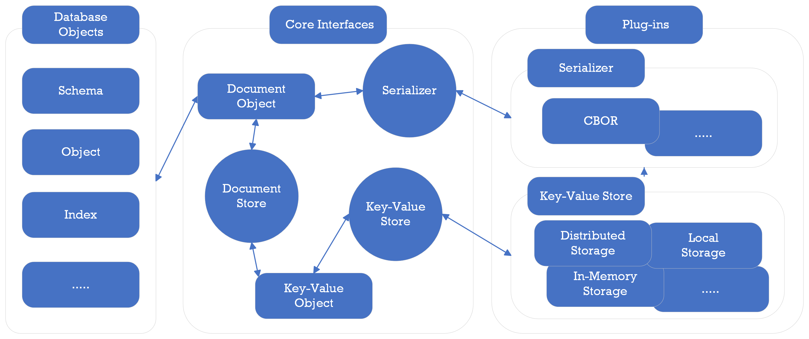

== Data Model

PuzzleDB is a multi‑model database. The core logical model is a document model layered atop an ordered key‑value store. All objects (data, schema, indexes) are represented as documents and ultimately persisted as key‑value pairs.

PuzzleDB defines a storage plugin interface enabling use of local in‑memory stores (e.g. memdb) or large distributed stores (e.g. FoundationDB, TiKV).

=== Document Model

The document model must be expressive (JSON / BSON level) similar to ARS (Atom‑Record‑Sequence) in CosmosDB.

PuzzleDB maps external data models (relational, document, key‑value) into its internal document representation:

[format="csv", options="header, autowidth"]
|====
include::model/all.csv[]
|====

==== See also

- https://github.com/cybergarage/puzzledb-go/blob/main/puzzledb/plugins/query/sql/type.go[plugins.query.sql.NewDocumentElementTypeFrom()]
- https://github.com/cybergarage/puzzledb-go/blob/main/puzzledb/plugins/query/mongo/encoder.go[plugins.query.mongo.BSONEncoder::EncodeBSON()]

=== Key-Value Object Model

The ordered key‑value model underpins all persisted objects. It provides flexible, scalable storage and efficient range operations.

All higher‑level objects are encoded as documents and stored as key‑value entries.

include::spec/store-kv-spec.adoc[leveloffset=+2]

==== See also

- https://github.com/cybergarage/puzzledb-go/blob/main/puzzledb/plugins/coder/key/tuple/coder.go[plugins.coder.key.tuple.Coder::EncodeKey()]

=== Document (Value) Object

The document abstraction is realized via coder plugins layered on key‑value storage. The default coder uses CBOR (Concise Binary Object Representation).

Documents are encoded using the active coder (CBOR by default) and persisted as key‑value entries. The relationship between the document model and CBOR encoding is shown below.

[format="csv", options="header, autowidth"]
|====
include::model/document-cbor.csv[]
|====

==== See also

- https://github.com/cybergarage/puzzledb-go/blob/main/puzzledb/plugins/coder/document/cbor/coder.go[plugins.coder.document.cbor.Coder::EncodeDocument()]

=== References

include::cosmosdb/references.adoc[leveloffset=+1]
* http://cbor.io/[CBOR — Concise Binary Object Representation | Overview]
