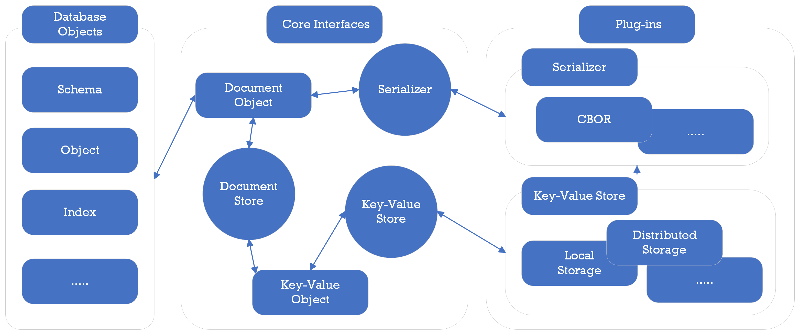

# Data Model

PuzzleDB is a multi-data model database and the core data model is a document model, and the document model is constructed based on a key value model currently. PuzzleDB represents all database objects such as data objects, schema objects, and index objects as document data. Document data are ultimately stored as Key-Value objects.

<figure>

</figure>

PuzzleDB defines a plug-in interface to the Key-Value store, which allows importing small local in-memory databases like memdb or large distributed databases like FoundationDB or TiKV.

## Document Model

PuzzleDB is a multi-data model database and the core data model is a document model like CosmosDB. PuzzleDB is a pluggable database that combines modules, and the storage layer modules must be as expressive as JSON or BSON like ARS (Atom-Record-Sequence) of CosmosDB.

PuzzleDB is a multi-model database, which converts any data models such as relational and document database models into the PuzzleDB data model as follows:

<table style="width:100%;">
<colgroup>
<col style="width: 16%" />
<col style="width: 16%" />
<col style="width: 16%" />
<col style="width: 16%" />
<col style="width: 16%" />
<col style="width: 16%" />
</colgroup>
<thead>
<tr class="header">
<th style="text-align: left;">Type</th>
<th style="text-align: left;">PuzzleDB</th>
<th style="text-align: left;">Redis</th>
<th style="text-align: left;">MongoDB</th>
<th style="text-align: left;">MySQL</th>
<th style="text-align: left;">PostgreSQL</th>
</tr>
</thead>
<tbody>
<tr class="odd">
<td style="text-align: left;">
Collection
</td>
<td style="text-align: left;">
map
</td>
<td style="text-align: left;">
Hash
</td>
<td style="text-align: left;">
Object
</td>
<td style="text-align: left;">
COMPLEX
</td>
<td style="text-align: left;"></td>
</tr>
<tr class="even">
<td style="text-align: left;"></td>
<td style="text-align: left;">
array
</td>
<td style="text-align: left;">
List
</td>
<td style="text-align: left;">
Array
</td>
<td style="text-align: left;">
ARRAY
</td>
<td style="text-align: left;"></td>
</tr>
<tr class="odd">
<td style="text-align: left;"></td>
<td style="text-align: left;"></td>
<td style="text-align: left;">
Sets
</td>
<td style="text-align: left;"></td>
<td style="text-align: left;"></td>
<td style="text-align: left;"></td>
</tr>
<tr class="even">
<td style="text-align: left;"></td>
<td style="text-align: left;"></td>
<td style="text-align: left;">
Sorted Sets
</td>
<td style="text-align: left;"></td>
<td style="text-align: left;"></td>
<td style="text-align: left;"></td>
</tr>
<tr class="odd">
<td style="text-align: left;">
String
</td>
<td style="text-align: left;">
string
</td>
<td style="text-align: left;">
String
</td>
<td style="text-align: left;">
String
</td>
<td style="text-align: left;">
TEXT
</td>
<td style="text-align: left;">
TEXT
</td>
</tr>
<tr class="even">
<td style="text-align: left;"></td>
<td style="text-align: left;"></td>
<td style="text-align: left;"></td>
<td style="text-align: left;"></td>
<td style="text-align: left;">
VARCHAR
</td>
<td style="text-align: left;">
VARCHAR
</td>
</tr>
<tr class="odd">
<td style="text-align: left;"></td>
<td style="text-align: left;"></td>
<td style="text-align: left;"></td>
<td style="text-align: left;"></td>
<td style="text-align: left;">
CHAR
</td>
<td style="text-align: left;">
CHAR
</td>
</tr>
<tr class="even">
<td style="text-align: left;">
Integer
</td>
<td style="text-align: left;">
tiny
</td>
<td style="text-align: left;"></td>
<td style="text-align: left;"></td>
<td style="text-align: left;">
TINYINT
</td>
<td style="text-align: left;"></td>
</tr>
<tr class="odd">
<td style="text-align: left;"></td>
<td style="text-align: left;">
short
</td>
<td style="text-align: left;"></td>
<td style="text-align: left;"></td>
<td style="text-align: left;">
SMALLINT
</td>
<td style="text-align: left;">
SMALLINT
</td>
</tr>
<tr class="even">
<td style="text-align: left;"></td>
<td style="text-align: left;">
int
</td>
<td style="text-align: left;"></td>
<td style="text-align: left;">
32-bit integer
</td>
<td style="text-align: left;">
INTEGER
</td>
<td style="text-align: left;">
INTEGER
</td>
</tr>
<tr class="odd">
<td style="text-align: left;"></td>
<td style="text-align: left;">
long
</td>
<td style="text-align: left;"></td>
<td style="text-align: left;">
64-bit integer
</td>
<td style="text-align: left;">
BIGINT
</td>
<td style="text-align: left;">
BIGINT
</td>
</tr>
<tr class="even">
<td style="text-align: left;">
Real
</td>
<td style="text-align: left;">
float32
</td>
<td style="text-align: left;"></td>
<td style="text-align: left;">
32-bit IEEE-754
</td>
<td style="text-align: left;">
FLOAT
</td>
<td style="text-align: left;">
REAL
</td>
</tr>
<tr class="odd">
<td style="text-align: left;"></td>
<td style="text-align: left;">
float64
</td>
<td style="text-align: left;"></td>
<td style="text-align: left;">
64-bit IEEE-754
</td>
<td style="text-align: left;">
DOUBLE (REAL)
</td>
<td style="text-align: left;">
DOUBLE (REAL)
</td>
</tr>
<tr class="even">
<td style="text-align: left;">
Time
</td>
<td style="text-align: left;">
time.Time
</td>
<td style="text-align: left;"></td>
<td style="text-align: left;">
Date
</td>
<td style="text-align: left;">
DATE DATETIME
</td>
<td style="text-align: left;"></td>
</tr>
<tr class="odd">
<td style="text-align: left;"></td>
<td style="text-align: left;"></td>
<td style="text-align: left;"></td>
<td style="text-align: left;">
Timestamp
</td>
<td style="text-align: left;">
TIME TIMESTAMP
</td>
<td style="text-align: left;">
TIMESTAMP
</td>
</tr>
<tr class="even">
<td style="text-align: left;">
Special
</td>
<td style="text-align: left;">
null
</td>
<td style="text-align: left;"></td>
<td style="text-align: left;">
Null
</td>
<td style="text-align: left;">
NULL
</td>
<td style="text-align: left;">
NULL
</td>
</tr>
<tr class="odd">
<td style="text-align: left;"></td>
<td style="text-align: left;">
bool
</td>
<td style="text-align: left;"></td>
<td style="text-align: left;">
Boolean
</td>
<td style="text-align: left;">
BOOLEAN (TINYINT(1))
</td>
<td style="text-align: left;">
BOOLEAN
</td>
</tr>
<tr class="even">
<td style="text-align: left;"></td>
<td style="text-align: left;">
[]byte
</td>
<td style="text-align: left;">
String
</td>
<td style="text-align: left;">
Binary data
</td>
<td style="text-align: left;">
BLOB (BYTEA)
</td>
<td style="text-align: left;">
BINARY
</td>
</tr>
</tbody>
</table>

## Key-Value Model

PuzzleDB represents all database objects such as data objects, schema objects, and index objects as document data. Document data are ultimately stored as Key-Value objects.

The document model is not natively implemented and is currently built on a key-value model with a coder plugin module. PuzzleDB provides a default coder, the CBOR (Concise Binary Object Representation ) plug-in module as the default coder.

PuzzleDB encodes a document data with a coder and stores it as a key-value data. The relationship between the default coder, CBOR data model, and the document data model is shown below.

<table>
<colgroup>
<col style="width: 33%" />
<col style="width: 33%" />
<col style="width: 33%" />
</colgroup>
<thead>
<tr class="header">
<th style="text-align: left;">Type</th>
<th style="text-align: left;">PuzzleDB</th>
<th style="text-align: left;">CBOR</th>
</tr>
</thead>
<tbody>
<tr class="odd">
<td style="text-align: left;">
Collection
</td>
<td style="text-align: left;">
map
</td>
<td style="text-align: left;">
5 (map)
</td>
</tr>
<tr class="even">
<td style="text-align: left;"></td>
<td style="text-align: left;">
array
</td>
<td style="text-align: left;">
4 (array)
</td>
</tr>
<tr class="odd">
<td style="text-align: left;">
String
</td>
<td style="text-align: left;">
string
</td>
<td style="text-align: left;">
3 (text string)
</td>
</tr>
<tr class="even">
<td style="text-align: left;">
Integer
</td>
<td style="text-align: left;">
tiny
</td>
<td style="text-align: left;">
tiny
</td>
</tr>
<tr class="odd">
<td style="text-align: left;"></td>
<td style="text-align: left;">
short
</td>
<td style="text-align: left;">
short
</td>
</tr>
<tr class="even">
<td style="text-align: left;"></td>
<td style="text-align: left;">
int
</td>
<td style="text-align: left;">
int
</td>
</tr>
<tr class="odd">
<td style="text-align: left;"></td>
<td style="text-align: left;">
long
</td>
<td style="text-align: left;">
long
</td>
</tr>
<tr class="even">
<td style="text-align: left;">
Real
</td>
<td style="text-align: left;">
float32
</td>
<td style="text-align: left;">
7 (floating-point) 26
</td>
</tr>
<tr class="odd">
<td style="text-align: left;"></td>
<td style="text-align: left;">
float64
</td>
<td style="text-align: left;">
7 (floating-point) 27
</td>
</tr>
<tr class="even">
<td style="text-align: left;">
Time
</td>
<td style="text-align: left;">
time.Time
</td>
<td style="text-align: left;">
6 (tag) 0
</td>
</tr>
<tr class="odd">
<td style="text-align: left;">
Special
</td>
<td style="text-align: left;">
null
</td>
<td style="text-align: left;">
null
</td>
</tr>
<tr class="even">
<td style="text-align: left;"></td>
<td style="text-align: left;">
bool
</td>
<td style="text-align: left;">
bool
</td>
</tr>
<tr class="odd">
<td style="text-align: left;"></td>
<td style="text-align: left;">
[]byte
</td>
<td style="text-align: left;">
binary
</td>
</tr>
</tbody>
</table>

## References

-   [A technical overview of Azure Cosmos DB | Azure Blog and Updates | Microsoft Azure](https://azure.microsoft.com/en-gb/blog/a-technical-overview-of-azure-cosmos-db/)

    -   [Azure Cosmos DB conceptual whitepapers](https://learn.microsoft.com/en-us/azure/cosmos-db/whitepapers)

    -   [Schema-Agnostic Indexing with Azure DocumentDB](https://www.vldb.org/pvldb/vol8/p1668-shukla.pdf)

<!-- -->

-   [CBOR — Concise Binary Object Representation | Overview](http://cbor.io/)
