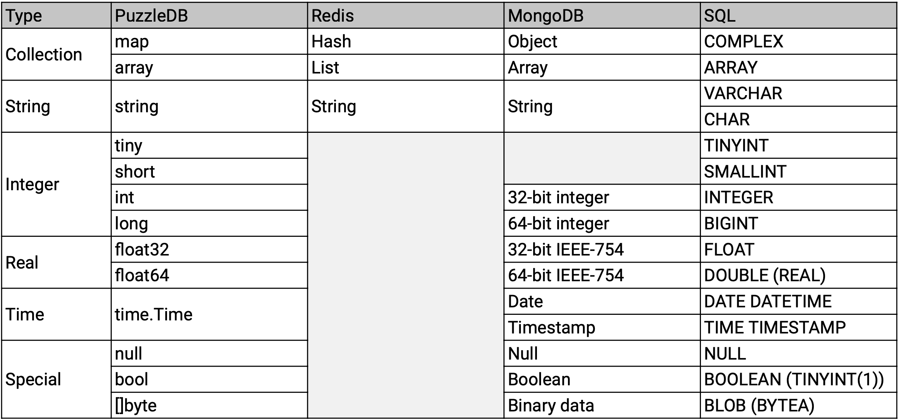
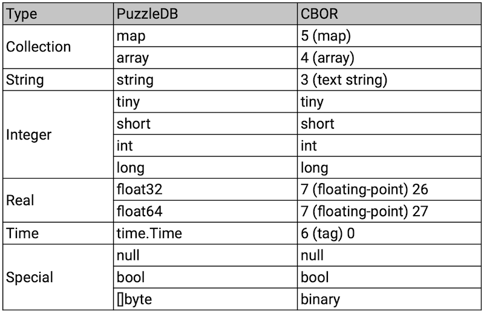

# Data Model

PuzzleDB is a multi-data model database and the core data model is a document model, and the document model is constructed based on a key value model currently.

## Concept

PuzzleDB represents all database objects such as data objects, schema objects, and index objects as document data. Document data are ultimately stored as Key-Value objects.

PuzzleDB defines a plug-in interface to the Key-Value store, which allows importing small local in-memory databases like memdb or large distributed databases like FoundationDB or TiKV.

## Document Model

PuzzleDB is a multi-data model database and the core data model is a document model like CosmosDB. PuzzleDB is a pluggable database that combines modules, and the storage layer modules must be as expressive as JSON or BSON like ARS (Atom-Record-Sequence) of CosmosDB.

PuzzleDB is a multi-model database, which converts any data models such as relational and document database models into the PuzzleDB data model as follows:

## Key-Value Model

The document model is not natively implemented and is currently built on a key-value model with a serializer plugin module. PuzzleDB provides a default serializer, the CBOR (Concise Binary Object Representation ) plug-in module as the default serializer.

PuzzleDB encodes a document data with a serializer and stores it as a key-value data. The relationship between the default serializer, CBOR data model, and the document data model is shown below.

## References
- [A technical overview of Azure Cosmos DB | Azure Blog and Updates | Microsoft Azure](https://azure.microsoft.com/en-gb/blog/a-technical-overview-of-azure-cosmos-db/)
- [Azure Cosmos DB conceptual whitepapers](https://learn.microsoft.com/en-us/azure/cosmos-db/whitepapers)
- [Schema-Agnostic Indexing with Azure DocumentDB](https://www.vldb.org/pvldb/vol8/p1668-shukla.pdf)
- [CBOR — Concise Binary Object Representation | Overview](http://cbor.io/)

