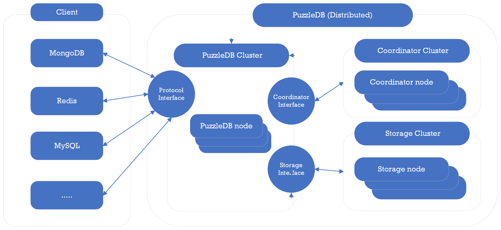

# Distributed Model

PuzzleDB is a pluggable database that combines modules, and a pluggable module interface is defined based on a FoundationDB-like layering concept. PuzzleDB separates the query layer and data model from the storage layer, the lowest storage layer is defined as a simple Key-Value store like FoundationDB and early Google Spanner.

## References

- [FoundationDB](https://www.foundationdb.org/)
  - [Layer Concept — FoundationDB ](https://apple.github.io/foundationdb/layer-concept.html)

- [Whitepapers  |  Cloud Spanner  |  Google Cloud](https://cloud.google.com/spanner/docs/whitepapers)
- [What is Cloud Spanner? A gcpsketchnote cheat sheet | Google Cloud Blog](https://cloud.google.com/blog/en/topics/developers-practitioners/what-cloud-spanner?hl=en)
- [Spanner: Google's Globally-Distributed Database](https://research.google/pubs/pub39966/)