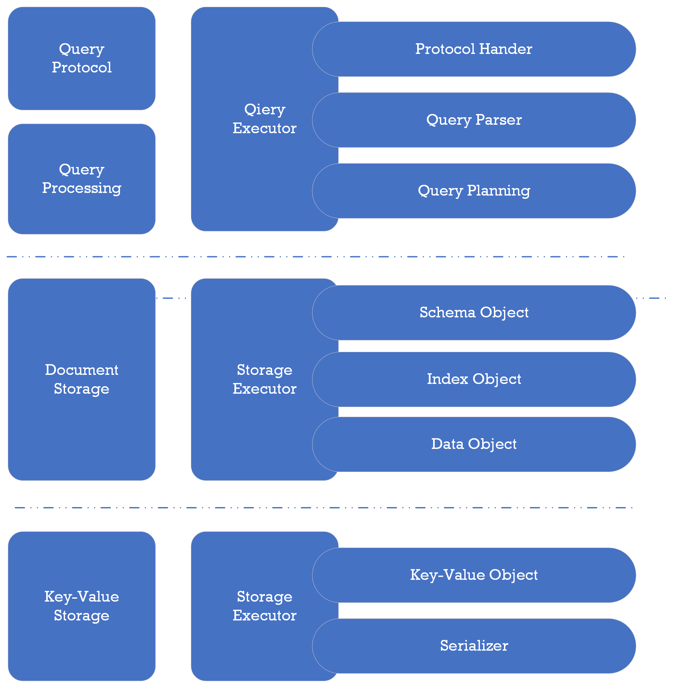

= Layer Concept

PuzzleDB adopts a unique approach similar to FoundationDB and early Google Spanner. It offers high scalability and ACID transactions while constructing its data model, indexes, and query processing on a foundation of simple key-value storage without any query functionality. 

In contrast, PuzzleDB has loosely coupled the query API, data model, and storage engine, enabling users to build their database with a suitable combination for their specific use cases and workloads. In PuzzleDB, not only are records represented as key-value pairs, but schemas and indices are also represented as key-value data.

== References

include::fdb/references.adoc[leveloffset=+1]
include::spanner/references.adoc[leveloffset=+1]