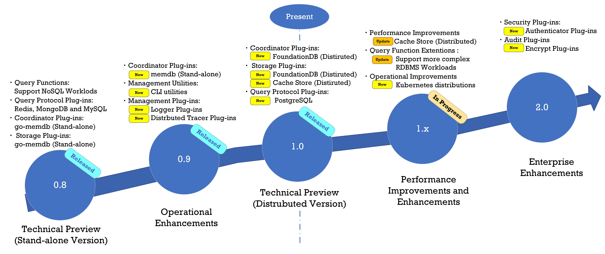

= Roadmap

PuzzleDB is currently in a technical preview release. Currently,
PuzzleDB is in the process of developing and testing a distributed
plugin for the next release. The development roadmap for PuzzleDB is shown below.

== v2.0.0
* Security Plug-ins
** [ ] Authenticator Plug-ins
** [ ] Audit Plug-ins
** [ ] Encrypt Plug-ins

== v1.5.0
* Query Plug-ins
** [ ] PostgreSQL Plug-in

== v1.0.0
* [ ] CLI Utilities
** [*] puzzledb-cli
* [ ] Distributed Tracer Plug-ins
** [ ] OpenTelemetry Plug-in
** [ ] OpenTracing Plug-in

== v0.9.0
* Coordinator Plug-ins
** [ ] etcd Plug-in
* Storage Plug-ins
** [*] FoundationDB Plug-in

== v0.8.x

* Coordinator Plug-ins
** [*] memdb Plug-in
* Configurator Plug-ins
** [*] puzzledb.yaml
* Operator Plug-ins
** gRPC Plug-in

== v0.8.0

* Query Plug-ins
** [*] MySQL Plug-in
** [*] Redis Plug-in
** [*] MongoDB Plug-in
* Storage Plug-ins
** [*] Document Plug-in
** [*] memdb Plug-in
