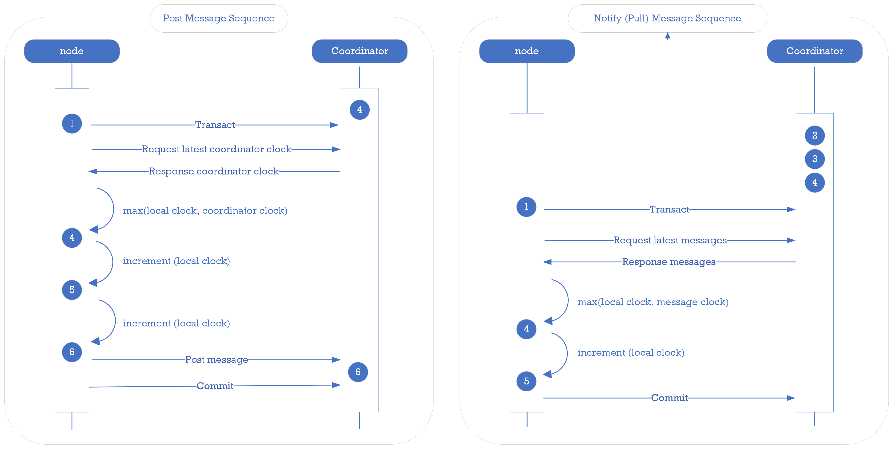

== Coordinator Messaging

The message box is used to store messages sent between PuzzleDB nodes in the cluster to notify any node and store status changes using the message key-value store.

=== Message Object

The message object is encoded as a CBOR object and stored as the value of the message key-value record. The message objects are defined for each type of message, but all message objects have the following required fields.

[format="csv", options="header, autowidth"]
|====
include::csv/coodinator-store-object.csv[]
|====

The type field is used to identify messages and the timestamp field is used to discard old messages.

=== Message Clock

Logical clocks, such as the Lamport Clock, are important in distributed systems because they can order events across different nodes; in PuzzleDB, to manage the message clock for the coordinator service, the conceptual Lamport Clock algorithm:

image:img/coordinator_clock.png[]

In practice, the coordinator node acts as a virtual message relay node between PuzzleDB nodes. The coordinator service uses the message clock to provide the total order of messages at all nodes in the system. To manage the message clock, PuzzleDB uses the Lamport Clock algorithm, which assigns a unique timestamp to each message sent by a node.

When sending a message, a PuzzleDB node obtains the latest logical clock from the coordinator node and uses it to timestamp the message. When a PuzzleDB node receives or retrieves a message from a coordinator node, it updates its own logical clock with the logical clock included in the message.