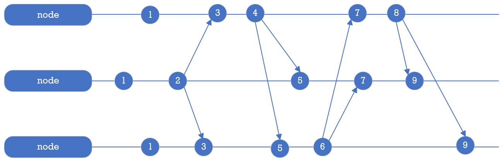

Coordinator Messaging
=====================

The message box is used to store messages sent between PuzzleDB nodes in the cluster to notify any node and store status changes using the message key-value store.

Message Clock
-------------

Logical clocks, such as the Lamport Clock, are important in distributed systems because they can order events across different nodes; in PuzzleDB, to manage the message clock for the coordinator service, the conceptual Lamport Clock algorithm:

In practice, the coordinator node acts as a virtual message relay node between PuzzleDB nodes. The coordinator service uses the message clock to provide the total order of messages at all nodes in the system. To manage the message clock, PuzzleDB uses the Lamport Clock algorithm, which assigns a unique timestamp to each message sent by a node.

When sending a message, a PuzzleDB node obtains the latest logical clock from the coordinator node and uses it to timestamp the message. When a PuzzleDB node receives or retrieves a message from a coordinator node, it updates its own logical clock with the logical clock included in the message.

Message Object
==============

The message object is encoded as a CBOR object and stored as the value of the message key-value record.

Message Object Header
---------------------

The message object has the following required header fields:

<table><colgroup><col style="width: 33%" /><col style="width: 33%" /><col style="width: 33%" /></colgroup><thead><tr class="header"><th>Field Name</th><th>Data Type</th><th>Description</th></tr></thead><tbody><tr class="odd"><td>
type
</td><td>
int
</td><td>
Message type
</td></tr><tr class="even"><td>
timestamp
</td><td>
time.Time
</td><td>
Generated phisical time
</td></tr></tbody></table>

The type field is used to identify messages and the timestamp field is used to discard old messages.

Message Object Value
--------------------

The message value object is encoded as a CBOR object and stored as the value of the message key-value record to the coordinator service. The message object has a message type, an event type and a CBOR encoded message object, and the standard message object is defined as follows:

<table><colgroup><col style="width: 33%" /><col style="width: 33%" /><col style="width: 33%" /></colgroup><thead><tr class="header"><th>Field</th><th>Type</th><th>Value</th></tr></thead><tbody><tr class="odd"><td>
ID
</td><td>
UUID
</td><td>
Destination node ID
</td></tr><tr class="even"><td>
Host
</td><td>
string
</td><td>
Destination host name
</td></tr><tr class="odd"><td>
Clock
</td><td>
uint64
</td><td>
Destination logical clock
</td></tr><tr class="even"><td>
Message Type
</td><td>
byte
</td><td>
Message type
</td></tr><tr class="odd"><td>
Event Type
</td><td>
byte
</td><td>
Event type
</td></tr><tr class="even"><td>
Object
</td><td>
[]byte
</td><td>
Message object (CBOR)
</td></tr></tbody></table>

The message value object has a defined object for each type of message, and the object is stored as a simple byte sequence encoded in CBOR in the message value.

Message Type and Event Type
---------------------------

The message types and the event types are reserved as follows:

<table><colgroup><col style="width: 25%" /><col style="width: 25%" /><col style="width: 25%" /><col style="width: 25%" /></colgroup><thead><tr class="header"><th>Message Type</th><th>Event Type</th><th>Occurrence Condition</th><th>Note</th></tr></thead><tbody><tr class="odd"><td>
Object (O)
</td><td>
Created ©
</td><td>
Object created
</td><td></td></tr><tr class="even"><td></td><td>
Update (U)
</td><td>
Object updated
</td><td></td></tr><tr class="odd"><td></td><td>
Delete (D)
</td><td>
Object deleted
</td><td></td></tr><tr class="even"><td>
Database (D)
</td><td>
Created ©
</td><td>
Database created
</td><td></td></tr><tr class="odd"><td></td><td>
Update (U)
</td><td>
Database updated
</td><td></td></tr><tr class="even"><td></td><td>
Delete (D)
</td><td>
Database deleted
</td><td></td></tr><tr class="odd"><td>
Collection ©
</td><td>
Created ©
</td><td>
Schema created
</td><td></td></tr><tr class="even"><td></td><td>
Update (U)
</td><td>
Shcema updated
</td><td></td></tr><tr class="odd"><td></td><td>
Delete (D)
</td><td>
Schema deleted
</td><td></td></tr><tr class="even"><td>
User Defined (U)
</td><td>
-
</td><td>
-
</td><td>
User-defined message. Event types are not defined.
</td></tr></tbody></table>

The object (O) message is notified when a store object is created, updated, or deleted in the coordinator store. The database (D) and collection © messages are notified by query services such as Redis, MySQL, and MongoDB.

The user (U) message preserves only the message type, and the event type and message value object are defined by the user.
