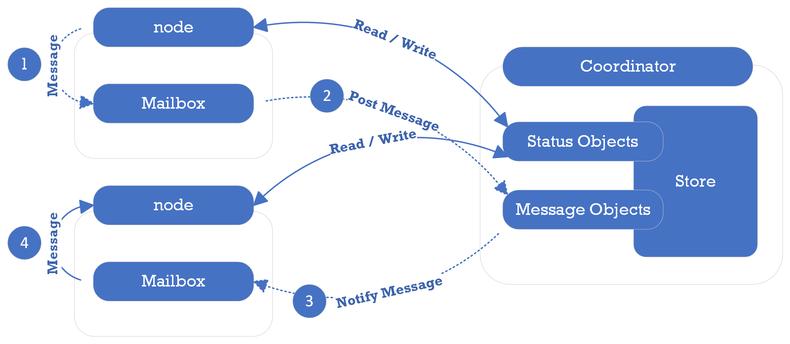
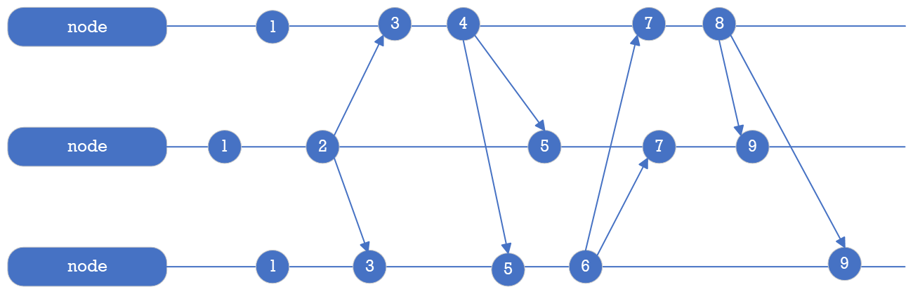

# Coordinator Specification

The coordinator service provides distributed synchronization and coordination for PuzzleDB nodes, as well as a distributed key-value store. This document describes the specifications of the information stored in the key-value store provided by the coordinator service.

## Store

The data stored in the key-value store of the coordinator service can be broadly classified into two categories: the first category includes data that holds state information, such as node information, and the second category includes data that holds messages exchanged between nodes in PuzzleDB.

The coordinator service provides a distributed key-value store for PuzzleDB nodes. The key-value store is a collection of key-value records, where each record is a key-value pair, consisting of a header as the key and a value as the value.

### Key Categories

The key-value store is a collection of key-value records, where each record is a key-value pair, consisting of a header as the key. The key-value store supports the following categories of key-value records:

<table>
<colgroup>
<col style="width: 20%" />
<col style="width: 20%" />
<col style="width: 20%" />
<col style="width: 20%" />
<col style="width: 20%" />
</colgroup>
<thead>
<tr class="header">
<th style="text-align: left;">Category</th>
<th style="text-align: left;">Key Order</th>
<th style="text-align: left;"></th>
<th style="text-align: left;"></th>
<th style="text-align: left;">Value</th>
</tr>
</thead>
<tbody>
<tr class="odd">
<td style="text-align: left;"></td>
<td style="text-align: left;">
0
</td>
<td style="text-align: left;">
1
</td>
<td style="text-align: left;">
2
</td>
<td style="text-align: left;"></td>
</tr>
<tr class="even">
<td style="text-align: left;">
Node
</td>
<td style="text-align: left;">
Header
</td>
<td style="text-align: left;">
Hostname
</td>
<td style="text-align: left;"></td>
<td style="text-align: left;">
CBOR (State)
</td>
</tr>
<tr class="odd">
<td style="text-align: left;">
Message
</td>
<td style="text-align: left;">
Header
</td>
<td style="text-align: left;">
Logical Clock
</td>
<td style="text-align: left;">
Message Type
</td>
<td style="text-align: left;">
CBOR (Message)
</td>
</tr>
</tbody>
</table>

### Key Header Specification

The key header is a 2-byte header that is prepended to every key in the key-value store. The key header is defined as follows:

<table>
<colgroup>
<col style="width: 25%" />
<col style="width: 25%" />
<col style="width: 25%" />
<col style="width: 25%" />
</colgroup>
<thead>
<tr class="header">
<th style="text-align: left;">Field Name</th>
<th style="text-align: left;">Size (bits)</th>
<th style="text-align: left;">Description</th>
<th style="text-align: left;">Example Value</th>
</tr>
</thead>
<tbody>
<tr class="odd">
<td style="text-align: left;">
Key category
</td>
<td style="text-align: left;">
8
</td>
<td style="text-align: left;">
The record key type
</td>
<td style="text-align: left;">
N:Node M:Message
</td>
</tr>
<tr class="even">
<td style="text-align: left;">
Version
</td>
<td style="text-align: left;">
4
</td>
<td style="text-align: left;">
The version number
</td>
<td style="text-align: left;">
0:reserved 1-7
</td>
</tr>
<tr class="odd">
<td style="text-align: left;">
Value type
</td>
<td style="text-align: left;">
4
</td>
<td style="text-align: left;">
The record value type
</td>
<td style="text-align: left;">
0:reserved 1:CBOR
</td>
</tr>
</tbody>
</table>

The key header begins with a 1-byte identifier for the key type, enabling key type-based searching. Duplication is tolerated because a value type is defined for each key type.

## Message Box

The message box is used to store messages sent between PuzzleDB nodes in the cluster to notify any node and store status changes using the message key-value store.

### Message Object

The message object is encoded as a CBOR object and stored as the value of the message key-value record. The message objects are defined for each type of message, but all message objects have the following required fields.

<table>
<colgroup>
<col style="width: 33%" />
<col style="width: 33%" />
<col style="width: 33%" />
</colgroup>
<thead>
<tr class="header">
<th style="text-align: left;">Field Name</th>
<th style="text-align: left;">Data Type</th>
<th style="text-align: left;">Description</th>
</tr>
</thead>
<tbody>
<tr class="odd">
<td style="text-align: left;">
type
</td>
<td style="text-align: left;">
int
</td>
<td style="text-align: left;">
Message type
</td>
</tr>
<tr class="even">
<td style="text-align: left;">
timestamp
</td>
<td style="text-align: left;">
time.Time
</td>
<td style="text-align: left;">
Generated phisical time
</td>
</tr>
</tbody>
</table>

The type field is used to identify messages and the timestamp field is used to discard old messages.

### Message Clock

Logical clocks, like the Lamport Clock, are important in distributed systems because they allow events to be ordered across different nodes. PuzzleDB uses the Lamport Clock algorithm to manage the message clock in the coordinator service as follows:

The coordinator node behaves as a virtual PuzzleDB node。 The coordinator node sends a message to itself to increment the clock. The coordinator node also sends a message to other nodes to increment their clocks.

The coordinator service uses a message clock to provide a total ordering of messages across all nodes in the system. To manage the message clock, PuzzleDB uses the Lamport Clock algorithm, which assigns a unique timestamp to each message sent by a node.
