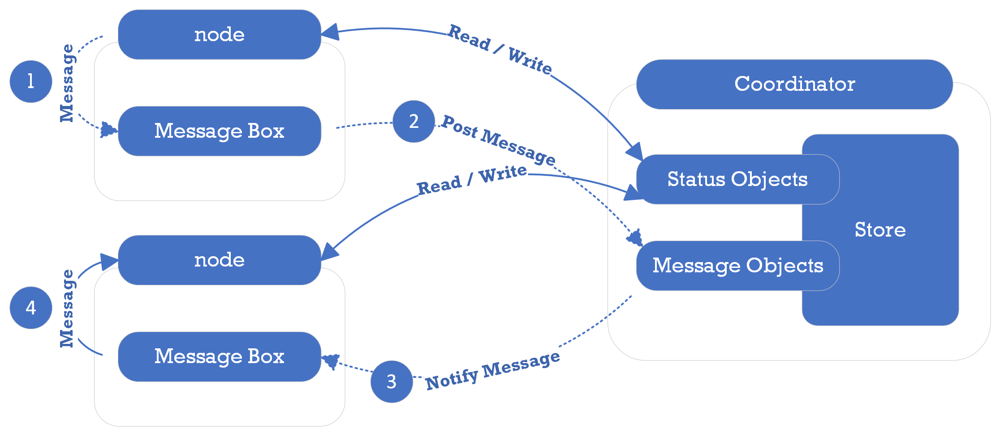

Coordinator Key-value Store
===========================

The coordinator sevice has a key-value store to commuicate with other nodes in PuzzleDB. The key-value store is a collection of key-value records, where each record is a key-value pair, consisting of a header as the key and a value as the value. The key-value store supports the following categories of key-value records:

The coordinator service provides a distributed key-value store for PuzzleDB nodes. The key-value store is a collection of key-value records, where each record is a key-value pair, consisting of a header as the key and a value as the value.

Key Categories
--------------

The key-value store is a collection of key-value records, where each record is a key-value pair, consisting of a header as the key. The key-value store supports the following categories of key-value records:

<table><colgroup><col style="width: 20%" /><col style="width: 20%" /><col style="width: 20%" /><col style="width: 20%" /><col style="width: 20%" /></colgroup><thead><tr class="header"><th>Category</th><th>Key Order</th><th></th><th></th><th>Value</th></tr></thead><tbody><tr class="odd"><td></td><td>
0
</td><td>
1
</td><td>
2
</td><td></td></tr><tr class="even"><td>
Message
</td><td>
Header (M)
</td><td>
Logical Clock
</td><td>
-
</td><td>
CBOR (Message)
</td></tr><tr class="odd"><td>
State
</td><td>
Header (S)
</td><td>
State Type
</td><td>
(Key)
</td><td>
CBOR (State)
</td></tr><tr class="even"><td>
Job
</td><td>
Header (J)
</td><td>
Job ID
</td><td>
-
</td><td>
CBOR (Job)
</td></tr></tbody></table>

The value of the coordinator store object is encoded and decoded in CBOR format as standard.

Key Header Specification
------------------------

The key header is a 2-byte header that is prepended to every key in the key-value store. The key header is reserved as follows:

<table><colgroup><col style="width: 25%" /><col style="width: 25%" /><col style="width: 25%" /><col style="width: 25%" /></colgroup><thead><tr class="header"><th>Field Name</th><th>Size (bits)</th><th>Description</th><th>Example Value</th></tr></thead><tbody><tr class="odd"><td>
Key category
</td><td>
8
</td><td>
The record key type
</td><td>
N:Node M:Message J:Job
</td></tr><tr class="even"><td>
Version
</td><td>
4
</td><td>
The version number
</td><td>
0:reserved 1-7
</td></tr><tr class="odd"><td>
Value type
</td><td>
4
</td><td>
The record value type
</td><td>
0:reserved 1:CBOR
</td></tr></tbody></table>

The key header begins with a 1-byte identifier for the key type, enabling key type-based searching. Duplication is tolerated because a value type is reserved for each key type.

State Objects
-------------

The coordinator service defines standard state objects to share state among the PuzzleDB nodes. The state object values are defined by category, but the standard state object header and key order are defined as follows:

<table style="width:100%;"><colgroup><col style="width: 16%" /><col style="width: 16%" /><col style="width: 16%" /><col style="width: 16%" /><col style="width: 16%" /><col style="width: 16%" /></colgroup><thead><tr class="header"><th>Category</th><th>Key Order</th><th></th><th></th><th></th><th>Value</th></tr></thead><tbody><tr class="odd"><td></td><td>
0
</td><td>
1
</td><td>
2
</td><td>
3
</td><td></td></tr><tr class="even"><td>
Node
</td><td>
Header (S)
</td><td>
State Type (N)
</td><td>
Cluster ID
</td><td>
Node ID
</td><td>
CBOR (Node Object)
</td></tr></tbody></table>
