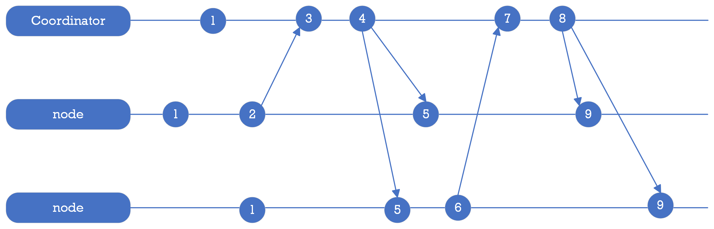

= Coordinator Store Specification

The coordinator service provides distributed synchronization and coordination for PuzzleDB nodes, as well as a distributed key-value store. This document describes the specifications of the information stored in the key-value store provided by The coordinator service.

== Key Categories

The key-value store is a collection of key-value records, where each record is a key-value pair, consisting of a header as the key. The key-value store supports the following categories of key-value records:

[format="csv", options="header, autowidth"]
|====
include::csv/coodinator-store-category.csv[]
|====

== Key Header Specification

The key header is a 2-byte header that is prepended to every key in the key-value store. The key header is defined as follows:

[format="csv", options="header, autowidth"]
|====
include::csv/coodinator-store-header.csv[]
|====

The key header begins with a 1-byte identifier for the key type, enabling key type-based searching. Duplication is tolerated because a value type is defined for each key type.

== Message

The message key-value record is used to store messages sent between PuzzleDB nodes in the cluster to notify any node and store status changes.

=== Message Clock

Logical clocks, like the Lamport Clock, are important in distributed systems because they allow events to be ordered across different nodes. PuzzleDB uses the Lamport Clock algorithm to manage the message clock in the coordinator service as follows:

The coordinator service uses a message clock to provide a total ordering of messages across all nodes in the system. To manage the message clock, PuzzleDB uses the Lamport Clock algorithm, which assigns a unique timestamp to each message sent by a node. 

=== Message Object

The message object is encoded as a CBOR object and stored as the value of the message key-value record. The message objects are defined for each type of message, but all message objects have the following required fields.

[format="csv", options="header, autowidth"]
|====
include::csv/coodinator-store-object.csv[]
|====

The type field is used to identify messages and the timestamp field is used to discard old messages.