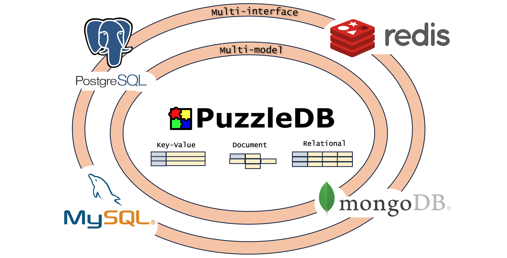

== What is PuzzleDB

PuzzleDB is a multi‑data‑model database capable of handling key‑value, relational, and document models. It is also multi‑interface, speaking existing protocols (PostgreSQL, MySQL, Redis, MongoDB).

PuzzleDB is a distributed framework supporting diverse models and protocols, designed for flexibility, scalability, and efficiency.

image:img/system.png[]

By accommodating existing query protocols, developers can adopt PuzzleDB with standard client drivers and minimal learning curve.

=== Key Features

PuzzleDB provides:

* Extensibility – Modular plugin architecture for queries, models, storage, coordination, tracing, metrics.
* Scalability – Seamless path from local in‑memory to shared‑nothing horizontal distribution via ordered key‑value storage.
* Compatibility – Supports major database protocol plugins (PostgreSQL, Redis, MongoDB, MySQL) easing migration.
* Reliability – ACID‑compliant storage and transaction semantics for correctness.
* Consolidation – Unified internal model representing key‑value, document, and relational data efficiently.